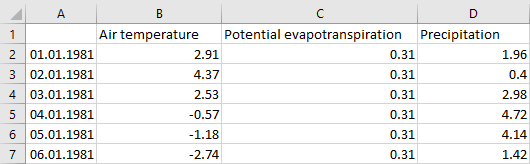
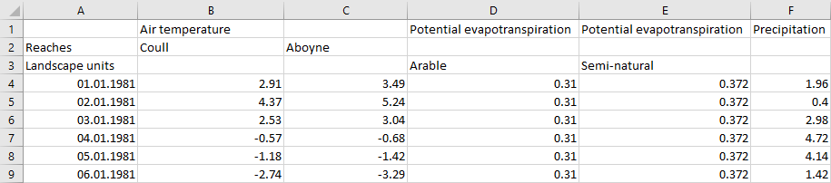
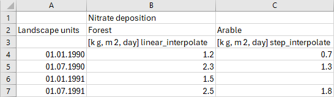

# The XLSX format

The spreadsheet format is very convenient to edit by hand if you have a program like Excel or OpenOffice calc.

## General information

You can have as many tabs (sheets) as you want in the file, and all of them will be loade by default. If you want to make Mobius2 ignore a tab (useful if you want to keep a tab for documentation or as a scratchpad), put `NOREAD` in cell A1 of that tab (apart from that it doesn't matter what you put in A1).

The names of the tabs are ignored. Any color coding or borders are also ignored, so you can use these to enhance human readability if you want to.

## The header and data blocks

Each sheet consists of a header and a data block. The header contains information about what time series the sheet contains (and any additional info about them), while the data block contains the actual values of the series.

In the easiest example, the header is just the first row and contains the names of some input series. The names have to start in cell B1 and continue along row 1 with one column per name. All names should be formatted as text (this is usually automatic).

In the data block, column A must be filled with dates, and can not have any empty cells between dates. This does not mean that dates must be consecutive (or even sequential), only that you can't have a row that does not start with a date.

The dates have to be formatted as *Date* or *Text* (this is usually automatic, but if not you can select the column, right click, and choose "format cells"). If they are formatted as text, they have to be on the form `YYYY-MM-DD`. If they are formatted as dates, the format displayed in the sheet is not important.

Note that Exel does not support date formatting for dates earlier than 1900-1-1, so these must be put as text. Moreover dates in the year 1900 can have a buggy internal format when formatted as a date, so it is safer to format them as text too.

In the values block you can have empty cells. These are treated as missing values.

Cell values can be results of Excel formulas. Mobius will read the value resulting from the formula, not the literal formula.

## Indexing

If you want to index a time series over multiple indexes (for instance to provide a separate series per "Reach" or "Landscape unit"), you must put one row below row 1 per index set you want to use. These rows have to have the name of the index set in cell A.

If you put an empty cell in the input name row, that column will be treated as belonging to the same input name as the last given input name before it on the row. For instance in the figure above both column B and C are "Air temperature" columns.

If you put an index name in the header in the row belonging to an index set and a column belonging to an input name, that input is treated as indexing over that index set, and this particular column is assigned to that index. For instance in the figure, "Air temperature" is indexed over "Reaches", "Potential evapotranspiration" is indexed over "Landscape units", and "Precipitation" is not indexed over anything (just having one "global" series). You can also make a series index over multiple index sets by putting one index per set. Note that all instances of the same input name must index over the same index sets (even if they are provided in different files).

## Flags

In the header you can optionally put a [series flags](datafiles.html#series-flags) row below all the other header rows, right above the data block. The A cell of this row must be empty (and must be the only empty cell in column A except for potentially A1 and cells at the bottom of the document). In the flags row you can put flags in the columns of the input series (you can have separate flags per series)

You can use flags also if you don't use indexing. In that case the flags row is the row right below the input name row (in this case row 2).

