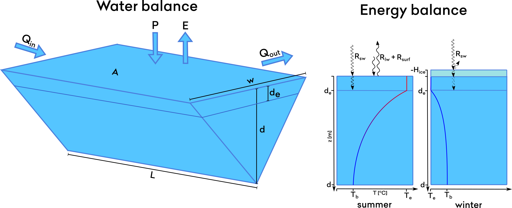

# EasyLake

This documentation is yet to be written. We apologize for the inconvenience.

## EasyLake physical

See the [mathematical description](autogen/easylake.html).

## EasyChem

## EasyChem particulate

## EasyTox

This is a contaminant module for EasyLake that uses many of the same principles as [SimplyTox](simply.html#simplytox). The contaminants in each lake compartment are partitioned between truly dissolved form, DOC and POC.

There is also surface-air and surface-sediment exchange of contaminants similar to how it is in the SimplyTox river compartment.