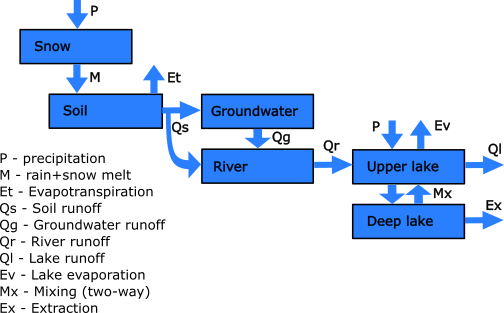
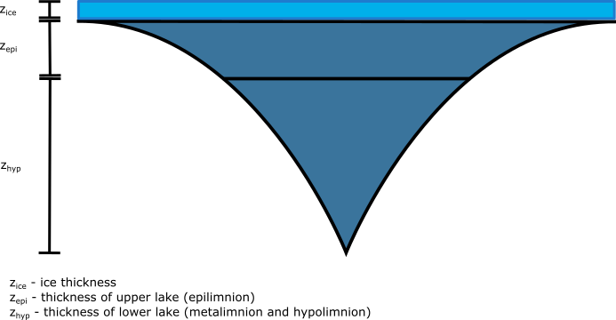
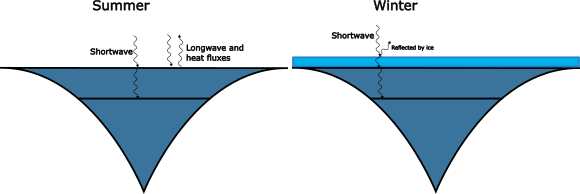

# EasyTox

EasyTox is a contaminant module for the EasyLake model, to be used in conjunction with the SimplyTox contaminant catchment model.

This page describes the version of the composite model that was built for the FuNitr project. We will only give an overarching description here, but source code, mathematical descriptions and published papers are also available.

## Hydrology and water balance

Figure: A conceptual water balance diagram for the model. This is a simplified diagram. It is possible to connect several river sections and lakes in arbitrary branching structures. Land hydrology can be separated into sub-catchments and land use classes.

### SimplyQ (catchment hydrology)

In this version of the SimplyQ hydrology model \[JacksonBlake17\], all precipitation is received by a snow layer, but if there is no snow, it continues directly to the soil water.

The snow module itself is based on the snow module in [HBV Nordic](https://publikasjoner.nve.no/publication/1996/publication1996_07.pdf). All precipitation are assumed to fall as snow below a given air temperature threshold (typically close to 0°C), and melts above another threshold. The snow has a small capacity to hold melt water, and only melt water above this capacity is discharged to the soil compartment.

The soil and groundwater compartments are so-called "linear reservoirs". In a linear reservoir, there is a water threshold below which there is no runoff. In the soil this is called the field capacity. Excess water above this threshold becomes runoff in a rate that is linearly proportional to the amount of excess water and inversely proportional to a given time constant.

In the soil there is also evapotranspiration which removes water from the system. There can be quick flow directly to the river when rain+melt is high.

A so-called "baseflow index" determines what proportion of the soil runoff goes to the groundwater. The remaining proportion goes to the river.

The retention time in the river is computed using [Manning's formula](https://en.wikipedia.org/wiki/Manning_formula), and some assumptions about the river slope and bank slope.

The lake runoff is computed using a rating curve that depends on the lake water level above the outlet level.

* The river retention time is typically short compared to the groundwater and lake, so processes in the latter two are usually more important for resulting contaminant concentrations.
* Even though the soil time constant is usually small, the field capacity can hold some amount of water, and so the effective soil retention time is higher than the soil water time constant. This also means that processes in the soil can be important.

### Lake physics

Figure: The subdivision and shape of a modeled lake.

Figure: Lake heat budget. Shortwave radiation goes into the lake and some of it passes through to the deep lake. In summer the heat budget also takes into account longwave, sensible and and latent heat fluxes. When there is ice cover, ice reflects most of the shortwave radiation, and the rest of the heat budget is coupled out, instead ice growth is governed by [Stefan's law for ice thickness](https://en.wikipedia.org/wiki/Stefan%27s_equation).

In the EasyLake module \[Norling22\], the shape of the lake follows a formula

$$
A(z) = A_0 \left(\frac{z}{z_{max}}\right)^{\theta+1\}
$$

where $$A(z)$$ is the area of the horizontal cross-section of the lake at level $$z$$, measured from the bottom up. The maximal depth of the lake is $$z_{max}$$. The parameter $$\theta$$ is user-configurable.

The lake is divided into two compartments, the Epilimnion (upper lake) and the Hypolimnion (bottom lake). Each of these are assumed to be internally fully mixed, but they only mix with one another when the temperature gradient is shallow. The thickness of the epilimnion can vary throughout the year.

The temperature is assumed to have a constant internal profile in the Epilimnion, while in the Hypolimnion it is assumed to vary gradually from the Epilimnion temperature down to a constant bottom temperature. See more details in [the mathematical specification](autogen/easylake.html).

Heat fluxes between the lake and the atmosphere are computed using [physically based formulas](autogen/auxiliary.html#airsea-lake).

Note: we also have available a more detailed lake model (NIVAFjord) that is divided into a configurable number of layers. This can be used if you want a more granular picture of the lake stratification and mixing.

## Contaminants

Dissolved contaminants will follow the water transport paths in proportion to the amount of transported water and the contaminant concentration. The exception is that evapotranspiration $$Et$$ and lake evaporation $$Ev$$ don't bring with them any contaminants.

All deposition of the contaminants go directly to the soil water. There is also direct deposition to the lake surface.

The model is a [Level IV multimedia fugacity model](https://en.wikipedia.org/wiki/Multimedia_fugacity_model). It for the most part follows the processes specified in \[Nizzetto15\].

This means that in each compartment, contaminants are partitioned between purely dissolved form, what is bound to dissolved organic carbon (DOC) and what is bound to solid organic carbon (solid soil carbon in the soil, particulate and sediment form in the river and lake and so on). The partitioning is governed by temperature and a contaminant-specific octanol-water partitioning coefficient. The dissolved contaminants also partition against air (in soil pores or against the atmosphere along the river and lake surfaces) governed by temperature and a contaminant-specific Henry's law constant. This means that a lake surface is a large source of contaminant loss to the atmosphere.

Carbon-bound contaminants are transported along with the carbon, such as with particle transport and settling in the river and lake.

Biodegradation can occur in all compartments. It has a [Q10-type temperature response](https://en.wikipedia.org/wiki/Q10_(temperature_coefficient)).

In the lake there is also photo-degradation in the Epilimnion.

# References

\[JacksonBlake17\] Jackson-Blake L. A., Sample J. E., Wade A. J., Helliwell R. C., Skeffington R. A. *Are our dynamic water quality models too complex? A comparison of a new parsimonious phosphorus model, SimplyP, and INCA-P*. Water Resources Research, 53, 5382–5399, [https://doi.org/10.1002/2016WR020132](https://doi.org/10.1002/2016WR020132), 2017

\[Norling21\] Norling, M. D., Jackson-Blake, L. A., Calidonio, J.-L. G., and Sample, J. E.: *Rapid development of fast and flexible environmental models: the Mobius framework v1.0*, Geosci. Model Dev., 14, 1885–1897, [https://doi.org/10.5194/gmd-14-1885-2021](https://doi.org/10.5194/gmd-14-1885-2021), 2021.

\[Norling22\] Norling, M. D., Clayer, F., Gundersen, C. B.: Levels of nitramines and nitrosamines in lake drinking water close to a CO2 capture plant: A modelling perspective, Env. Res. 212(D), [https://doi.org/10.1016/j.envres.2022.113581](https://doi.org/10.1016/j.envres.2022.113581), 2022

\[Nizzetto15\] Nizzetto L., Butterfield D., Futter M., Lin Y., Allan I., Larssen T. *Assessment of contaminant fate in catchments using a novel integrated hydrobiogeochemical-multimedia fate model*. Sci. Total Environ. 544, 553-563, [https://doi.org/10.1016/j.scitotenv.2015.11.087](https://doi.org/10.1016/j.scitotenv.2015.11.087) 2015

