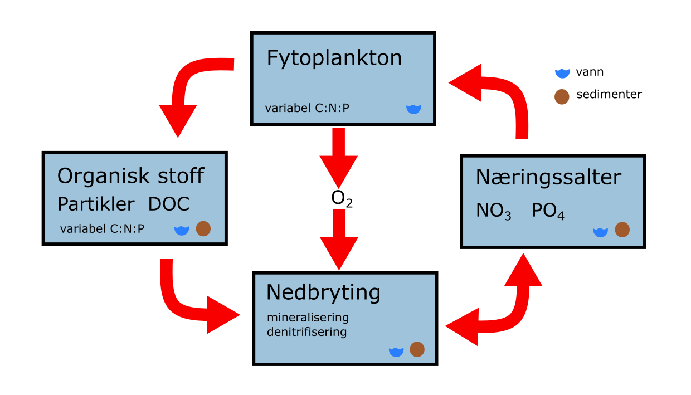

# NIVAFjord

NIVAFjord is a layered multi-basin model for fjords, lakes and lagoons. Each basin is a 1D layered model, but you can horizontally couple several basins.

The physics component of NIVAFjord is loosely based on the model [Eutrofimodell for Indre Oslofjord (Norwegian only)](https://niva.brage.unit.no/niva-xmlui/handle/11250/207887).

## Basin

This is the physics component of a single basin. It computes water balance, temperature, salinity and vertical mixing fluxes.

The basin model assumes that each vertical layer is always completely horizontally mixed, but you can have stratification between different layers.

Turbulent mixing energy is assumed to be constant, only depending on basin and depth, and is thus calibrated instead of simulated. Wind mixing and mixing from ship activity is added on top.

See the [mathematical description](autogen/nivafjord.html#nivafjord-basin).

## Horizontal exchange

With multiple basins, you can have horizontal exchange between the basins.

Horizontal flow velocity is proportional to the square root of the pressure difference between two neighboring layers. A layer will discharge to the first neighboring layer next to or below it that has the same density as itself.

Pressure differences can either be barotropic (caused by different water levels, e.g. due to tides or river inputs) or barocline (caused by differences in the pressure gradient due to temperature or salinity).

You can also create boundary basins where all physiochemical characteristics are user-provided instead of being computed, to simulate the open boundary of a basin to the wider ocean.

## FjordChem

This is the biochemical component of NIVAFjord, simulating nutrients (CNP), phytoplankton, microbial processes and suspended particles.

See the [mathematical description](autogen/nivafjord.html#nivafjord-chemistry).

## Sediments

This is the sediment component of NIVAFjord, simulating nutrients (CNP) and microbial processes.

See the [mathematical description](autogen/nivafjord.html#nivafjord-sediments).