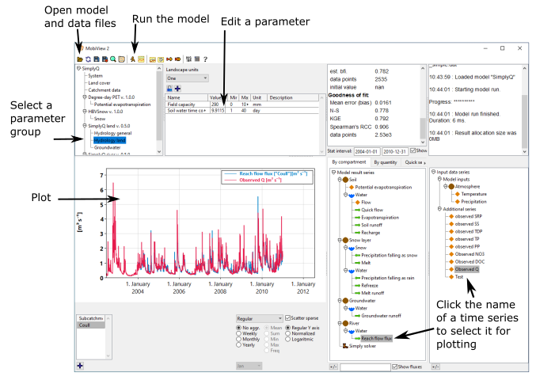

# Getting started

## Download Mobius2 and run a model

The easiest way to run models in Mobius2 is to use the MobiView2 graphical user interface. You need to
1. Get the Mobius2 repository from github.
2. Get the MobiView2 program.
	
### 1. Get the Mobius2 repository from github.

The reason you want to get the Mobius2 repository is that it contains many existing models and data set examples that you can work with. You will not need to compile the Mobius2 framework itself.

Clone the repository [https://github.com/NIVANorge/Mobius2](https://github.com/NIVANorge/Mobius2). This can be done by using your favourite git client such as [Tortoise git](https://tortoisegit.org/) or [Github desktop](https://desktop.github.com/).

You can also download a zip archive of the repository from the front page, but then it is not as convenient to get the latest updates.

### 2. Get the MobiView2 program.

For now we only support MobiView2 on Windows. It is technically possible to compile it on Linux, so if you need that, please contact us.

Open ftp://mobiserver.niva.no/Mobius2 in a file explorer (not a web browser), then download the entire MobiView2 folder.

Edit MobiView2/config.txt so that the "Mobius2 base path" field contains the location where you put Mobius2, e.g. `"C:/Data/Mobius2"`.

You can now run MobiView2.exe. Click the open icon in the top left and select e.g. `"Mobius2/models/simplyq.txt"`, then `"Mobius2/models/data/simplyq_simple.dat"`. If the model loaded correctly you can now run it by clicking the orange runner icon in the MobiView2 top bar. You can then select series to plot in the result and input series selections in the bottom right.

If you chose simplyq.txt, you are running [SimplyQ](../existingmodels/simply.html#simplyq), which is a simple hydrology model for predicting river discharge.

Next, you can select a parameter group in the top left, which will allow you to edit parameter values in the top center. After changing some values, you can re-run the model and see 

## Further steps

What you want to do next depends on what you want to use Mobius2 for, so not all the options below may be relevant to you.

### Get to know the existing models.

A good place to start is to get aquainted with the [existing models](../existingmodels/existingmodels.html) to see if they suit your modelling needs or to use them as an inspiration for your own models. Most of these come with example datasets in the repository. You open these models from `Mobius2/models`, and the example data files are in `Mobius2/models/data`.

### Learn the data format to set up models for other locations.

To set up a model for a new location you may need to edit the [data files](../datafiledocs/datafiles.html) in a text editor. It can be a good idea to use an existing example as a base and just edit it.

### Learn more about MobiView2.

MobiView2 contains many more features that can help you to quickly calibrate or autocalibrate your model, generate various types of plots, and run sensitivity analysis.

See [the full documentation](../mobiviewdocs/mobiview.html).

### Use mobipy to script your model runs.

The mobipy python package allows you to dynamically set parameter values and input series, and exctract result series from the model via python. This is useful if you want to script model runs to e.g.
- Run many different scenarios where you load data from some secondary source, without having to make many separate model data files.
- Script your own sensitivity analysis or autocalibration.
- Run the models in the backend of a web page with a custom web interface.
- Whatever you can think of.

To be able to run mobipy you need to download mobipy/c_abi.dll from ftp://mobiserver.niva.no/Mobius2 and put it in your local Mobius2/mobipy folder.

See [the full documentation](../mobipydocs/mobipy.html).

### Build new models or modify existing ones using the Mobius2 language.

Mobius2 models are specified in the Mobius2 language. If you need to make modifications to existing modules, make new modules, or combine modules to new models you need to learn how to use this language. The language is designed to make it easy to use even if you don't know much programming, and it does most of the heavy lifting for you.

The [Guide](../mobius2docs/guide.html) is a good place to start.

### Involve yourself with feedback to the developer team, or become a developer.

Please use the github issues tracker to report bugs. You can also contact us at `magnus.norling@niva.no`