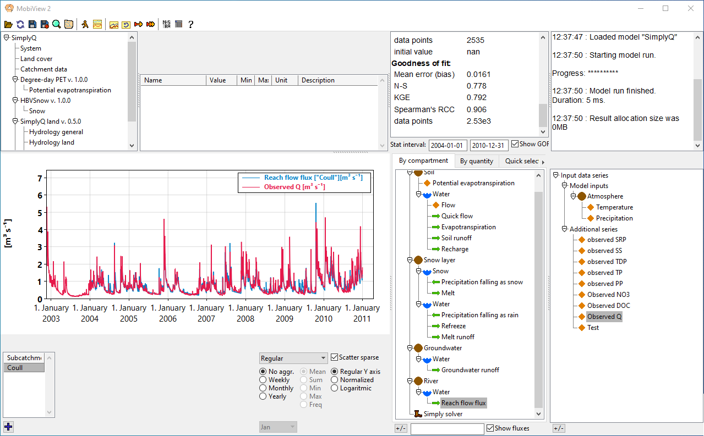

# Mobius2

## The framework for fast and flexible biogeochemical modelling

**(This is a construction site. We apologize for the temporary inconvenience)**

Mobius2 is a modelling framework for biogeochemical models. It allows you to model such things as transport of and processes of nutrients and contaminants in e.g. catchments, rivers, lakes and ocean basins. The framework allows you to couple modules for many different modular components into a single integrated model. It also makes it easy to modify or write new modules.

See how to quickly [get started](gettingstarted/gettingstarted.html).

## Existing models

The Mobius2 framework comes with several (existing modules and models)[existingmodels/existingmodels.html] that can be used directly or modified to accomodate new research questions. These include
- The [Simply family](existingmodels/simply.html) is a family of catchment models building on the hydrology model SimplyQ. Modules for nutrients and contaminants exist.
- [EasyLake](existingmodels/easylake.html) is a simple 2-box lake model that is intended for inclusion into a larger catcment model. It predicts residence time, temperature and ice in the lake, and has modules for nutrients retention and contaminants.
- [NIVAFjord](existingmodels/nivafjord.html) is a 1-dimensional layered basin model that can be used to model e.g. fjords, lagoons and lakes. It has biochemistry modules for nutrients, phytoplankton and sediments.

## Support infrastructure

Any model created in Mobius2 can be run from the graphical user interface [MobiView2](mobiviewdocs/mobiview.html) and in the [mobipy](mobipydocs/mobipy.html) python package. This allows model creators and users to interact with the models in powerful and user friendly ways.

## The Mobius2 language

The [Mobius2 language](mobius2docs/language.html) can be used to model any system ordinary differential equations or discrete step equations (such as population models or economic system dynamics models), but has special support for mass balance of transported substances, with automatic transport of dissolved substances.

Different modules for water transport (for instance soils, rivers, lakes) can be coupled without them knowing about one another, and biochemical components can be specified independently of the transport modules.

Mobius2 also provides special support for transport along directed graphs and grids. This can be used to model for instance branched river networks, downhill drainage, hydraulic systems, layered lakes, fjords and lagoons and more.

## Authors and acknowledgement

The Mobius2 framework is developed by Magnus Dahler Norling for [The Norwegian Institute for Water Research](https://www.niva.no/en) (NIVA).

Additional contributions:
Leah Jackson-Blake (Simply models, general testing), François Clayer (EasyLake model, general testing).

Please use the issue tracker on the github page to report bugs. For general questions and feedback, please contact `magnus.norling@niva.no`.

## Usage and attribution

Mobius2 is © Norsk Institutt for Vannforskning, NIVA (The Norwegian Institute for Water Research) 2024. Mobius2 is published open source under the Apache 2.0 license. See the [LICENSE](https://github.com/NIVANorge/Mobius2/blob/main/LICENSE) file in the github repository for details.

We would be grateful if publications that use Mobius2 or a model developed in Mobius2 provide a link to this page.

## Mobius1

The original version of Mobius can be found here:
[https://github.com/NIVANorge/Mobius](https://github.com/NIVANorge/Mobius)
Mobius supports some models that have not been ported over to Mobius2 yet.
