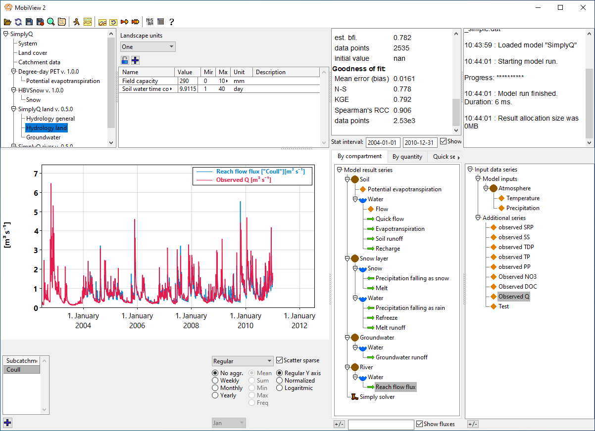

# Mobius2

## The framework for fast and flexible environmental modelling

Mobius2 is a modelling framework for environmental models such as biogeochemical and water quality models. It allows researchers to easily create new models that run fast and are user friendly.

The framework allows you to model things like hydrology, and transport and biochemical processes of nutrients and contaminants in catchments, rivers, lakes and ocean basins. It allows you to compose modules for many different components into a single integrated model.

See how to quickly [get started](gettingstarted/gettingstarted.html).

## Existing models

The Mobius2 framework comes with several [existing modules and models](existingmodels/existingmodels.html) that can be used directly or modified to accommodate other use cases, different data availability, or new research questions.
- The [Simply family](existingmodels/simply.html) is a family of catchment models building on the hydrology model SimplyQ. Modules for nutrients and contaminants exist.
- [EasyLake](existingmodels/easylake.html) is a simple 2-box lake model that is intended for inclusion into a larger catcment model. It predicts residence time, temperature and ice in the lake, and has modules for nutrients retention and contaminants.
- [NIVAFjord](existingmodels/nivafjord.html) is a 1-dimensional layered basin model that can be used to model e.g. fjords, lagoons and lakes. It has biochemistry modules for nutrients, phytoplankton and sediments.
- [MAGIC](existingmodels/magic.html) is a model for long-timescale evolution of soil water chemistry (with a focus on acidity) in smaller catchments.

Most Mobius2 models can be coupled to one another in larger transport networks.

Figure: Example of a Mobius2 model application at the [Vannsjø-Moss watershed](https://en.wikipedia.org/wiki/Vansj%C3%B8). The drainage basin of the river is delineated into subcatchments (light green) and lakes (dark blue). The outlet is connected to a fjord basin (purple). The subcatchments are subdivided into land use, shown in one of the subcatchments with urban (red), agricultural (yellow) and semi-natural (green). (The visualization is not a part of Mobius2, it was created using [pygmt](https://www.pygmt.org/latest/) and [OpenStreetMap](https://www.openstreetmap.org/copyright) - ©OpenStreetMap contributors).

## Support infrastructure

Any model created in Mobius2 can be run from the graphical user interface [MobiView2](mobiviewdocs/mobiview.html), in the [mobipy](mobipydocs/mobipy.html) python package and the [mobius.jl](mobius_jl_docs/mobius_jl.html) Julia package. This allows model creators and users to interact with the models in powerful and user friendly ways. Included are multiple types of plots, and state-of-the-art autocalibration, uncertainty and sensitivity analysis.

## The Mobius2 language

The [Mobius2 language](mobius2docs/language.html) can be used to model any system ordinary differential equations or discrete step equations (such as population models or economic system dynamics models), but has special support for mass balance of transported substances, with automatic transport of dissolved substances.

Different modules for water transport (for instance soils, rivers, lakes) can be coupled without them knowing about one another, and biochemical components can be specified independently of the transport modules.

Mobius2 also provides special support for transport along directed graphs and grids. This can be used to model for instance branched river networks, downhill drainage, hydraulic systems, layered lakes, fjords, lagoons, stacked aquifers and more.

## Authors and acknowledgement

The Mobius2 framework is developed by Magnus Dahler Norling for [The Norwegian Institute for Water Research](https://www.niva.no/en) (NIVA).

Additional contributions:
Leah Jackson-Blake (Simply models, general testing), François Clayer (EasyLake model, general testing).

Please use the issue tracker on the github page to report bugs. For general questions and feedback, please contact `magnus.norling@niva.no`.

## Usage and attribution

Mobius2 is © Norsk Institutt for Vannforskning, NIVA (The Norwegian Institute for Water Research) 2024. Mobius2 is published open source under the Apache 2.0 license. See the [LICENSE](https://github.com/NIVANorge/Mobius2/blob/main/LICENSE) file in the github repository for details.

We would be grateful if publications that use Mobius2 or a model developed in Mobius2 provide a link to this page.

## Mobius1

The original version of Mobius can be found here:
[https://github.com/NIVANorge/Mobius](https://github.com/NIVANorge/Mobius)
Mobius supports some models that have not been ported over to Mobius2 yet.
