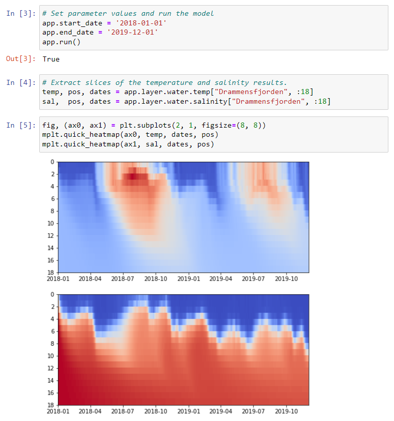
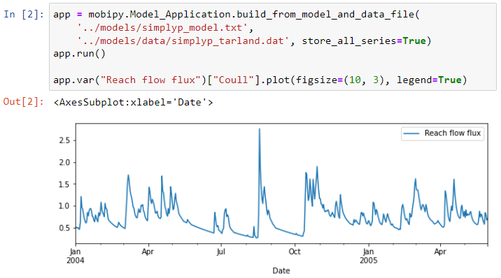

# mobipy

The mobipy python package can be used to run Mobius2 models from python (64 bit python3 only).

It lets you set parameter values and input series dynamically and read out result data.

Among other things, this allows you to:

- Automate running of many different scenarios. For instance, your script could access various climate scenarios from a database (or files), set them as forcings in the model, then storing and comparing the results. This can be done without generating different input files for the model.
- Make a website for stakeholder interaction that uses a python backend such as [streamlit](https://streamlit.io/), and have it dynamically run a model based on a custom user web interface or forecasts from a database. See one [example of this being done with INCA-Microplastics](https://ikhapp.org/inca-microplastics/) using Mobius1.
- Write your own autocalibration and uncertainty analysis scripts if you need something more specific than what you find in [MobiView2](../mobiviewdocs/sensitivity.html).



Figure: An example of running the [NIVAFjord](../existingmodels/nivafjord.html) model with mobipy in a [jupyter notebook](https://jupyter.org/).

You can also look at some more [example notebooks](https://github.com/NIVANorge/Mobius2/blob/main/example_notebooks/).

## Installation

This assumes you have already followed the [getting started guide](../gettingstarted/gettingstarted.html) and cloned the Mobius2 repository.

- Windows: To be able to run mobipy on Windows you need to download mobipy/c_abi.dll from ftp://mobiserver.niva.no/Mobius2 and put it in your local Mobius2/mobipy folder.
- Linux: See the [separate document](linux_install.html)

## Basic usage

It is useful to look at the [central model concepts](../mobius2docs/central_concepts.html) to understand what we mean by certain terms below like ("parameter", "state variable", "identifier", etc.).

First you need to load a model application using
```python
app = mobipy.Model_Application.build_from_model_and_data_file(
	"path/to/model.txt", 
	"path/to/data.dat")
```
To be able to extract any results you need to run the model, using
```python
app.run()
```

It is important to note that the `Model_Application` object is not python-serializable, so you can not access the same app object across multiple processes. Using multiple threads works fine, just note that operations modifying the state of the app (running the model, modifying parameters, etc.) are not thread safe. If you want to run the model in several parallel instances, you can make copies of the working dataset as seen below.

```python
# This is a thread safe way to run a model instance in parallel.
def run_model_instance(app) :
	data = app.copy()
	#modify_some_parameters(data)
	data.run()
	#do_something_with_the_results(data)
	del data
```

### Acessing model entities

Any [model entity](../mobius2docs/central_concepts.html) can in principle be accessed in the `app`, but for the most part it only makes sense to access modules, parameters or components.

Entities are accessed using one of the following methods

- `scope.identifier` where `identifier` is the [Mobius2 language identifier](../mobius2docs/declaration_format.html#entities-and-identifiers) of the entity in the given model scope.
- `scope["Name"]` where `"Name"` is the Mobius2 language name of the entity in the given model scope.

The `app` acts as the model top scope. You can then scope into modules from it using e.g.

```python
app["Module name"]
```

For a full example,

```python
app["SimplyQ land"].bfi
```

accesses the `bfi` parameter in the `"SimplyQ land"` module. You can also store scopes in variables to reuse them:

```python
sq = app["SimplyQ land"]
sq.bfi = 0.1
```

The time series of a state variable can be accessed by composing the Mobius2 components for the [*location*](../mobius2docs/central_concepts#components-and-locations) (if one exists), e.g. the river water dissolved organic carbon could be (depending on how it is declared in the model)

```python
app.river.water.oc
```

You can also access any model series (result or input) using

```python
app.var("Series name")
```

where `"Series name"` is the name (either series serialized name or declared name) of the series in the current application. (Note that the declared name - from the `var` declaration - does not always identify the series uniquely, but usually it does).

### Parameters

You can set the value of a parameter by using the regular field setting syntax in python, e.g.

```python
app.start_date = '1995-01-01'
```

However if the parameter indexes over one or more index sets, you have to provide an index (tuple) for it. E.g.

```python
app["SimplyQ land"].tc_s["Agricultural"] = 3
```

Here "Agricultural" is an index of the index set that this parameter is distributed over.

Remember that you must re-run the model for the parameter edit to take effect in the results.

To read the value you must always provide an index even if it doesn't index over anything. If there are no index sets, use `[()]`.

```python
print("The start date is %s" % app.start_date[()])
```

Parameters also have the `min()`, `max()`, `unit()` and `description()` member functions that let you extract this information from their declaration in the model. These must be called on the Entity, not on the value access (i.e. don't index it).

### Series

When you read the values of a series, you must access it using its indexes. If the series does not have any index sets, you must still access it using an empty tuple `[()]`. The result of reading a series is a `pandas.Series`. See the [pandas documentation](https://pandas.pydata.org/pandas-docs/stable/reference/api/pandas.Series.html). It is indexed by a `pandas.DateTimeIndex`. It is convenient to quickly plot such series, as in the example below.



You can also construct a `pandas.DataFrame` from several such series (using pandas.concat), which is one of the most common ways to organize scientific data in python.

If a series indexes over several indexes you can read out a slice. We only support slicing one index set at a time for now, and no custom strides. When slicing, instead of a ´pd.Series´ you get a tuple `(values, position, dates)`, where `values` is a `numpy.ndarray` with dimensions `(time_steps, n_indexes)`. Here `n_indexes` is the amount of indexes in the slice range. Example

```python
temps, pos, dates = app.layer.water.temp["Drammensfjorden", 4:10]
```

In this example, the temperatures in the "Drammensfjorden" basin in [NIVAFjord](../existingmodels/nivafjord.html) is extracted between layers 4 and 10.

The `pos` vector is of size `n_indexes+1` and contains the boundaries of the indexes in the slice. The `dates` vector is of size `time_steps+1` (the last value being the first time step after the model run). These contain the boundaries because this is more convenient for plotting heatmaps. If you only want positions of each data point, discard the last element in `pos` and `dates`.

For input series you always get the expanded data that is sampled to the application's sampling frequency, even if it was provided sparsely in the data file.

You can also set the values of an input series. The value you provide must be a `pandas.Series` that is indexed by a `DateTimeIndex`. This could be sparse. In that case, only the given dates are overwritten.

For now we don't support setting slices.

Model series have a `unit()` member function giving you a string representation of its unit.

You can also get the concentration series of a dissolved variable using `conc()`. For a flux, you can further use the `.` operator to get the transport flux of dissolved variables.

The conc and transport operations must be called on the `mobipy.Series` object, not on the `pandas.Series` value (i.e. don't index it before the operation). Example:

```python
# Correct:
fig, (ax0, ax1) = plt.subplots(2, 1, figsize=(8, 8))
# Plot the concentration of organic carbon in the river water.
app.river.water.oc.conc()["Kråkstadelva"].plot(ax=ax0)
# Plot the transport flux of organic carbon with the river discharge.
app.var("Reach flow flux").oc["Kråkstadelva"].plot(ax=ax1)

# Wrong:
app.river.water.oc["Kråkstadelva"].conc()
app.var("Reach flow flux")["Kråkstadelva"].oc
```