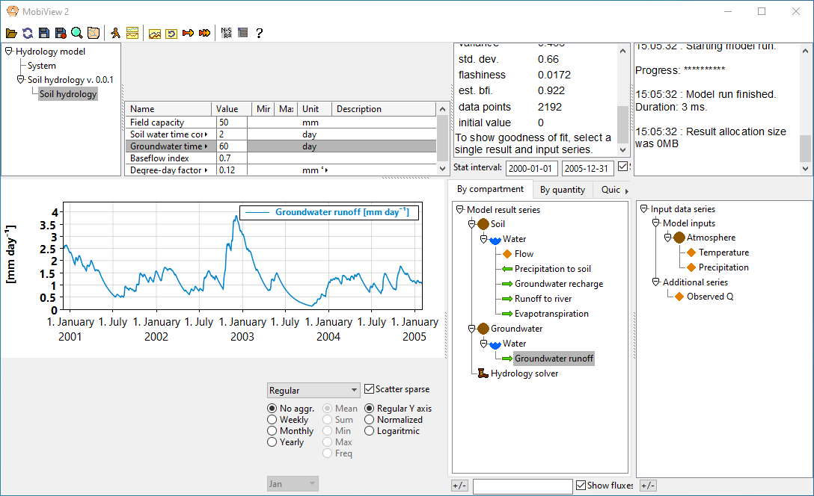

# Quantities, fluxes and solvers

In this chapter we will build a simple hydrology model and see how you can use Mobius2 to specify transport of water between different compartments.

We refer to the [environmental modelling notebooks](https://nbviewer.org/github/JamesSample/enviro_mod_notes/blob/master/notebooks/05_A_Hydrological_Model.ipynb) for a more detailed description of a very similar model.

From now on we will not display the entire model code in the guide page, only the new parts we create.

We start with a blank model and create the following location components

```python
air  : compartment("Atmosphere")
soil : compartment("Soil")
gw   : compartment("Groundwater")

temp   : property("Temperature")
precip : property("Precipitation")

water  : quantity("Water")
```

Here, `water` is declared as a `quantity`, which means that it can be transported using what we call fluxes. In Mobius2, a flux just means transport rate between two locations.

Quantities will usually not have code to describe their value (except their initial value). Instead, we use fluxes to specify the rate of change of the quantity.

We create a new module in the model, and set up some quantities with initial values.

```python

# It is common to model water in hydrology models using how much water is in a single column of the soil.
# One can think of it as how high the water level would be if one digs a hole in the soil and remove the
# solids (and no extra water drains into the hole).

par_group("Soil hydrology") {

	# The field capacity is how much water the soil can be filled with before there is runoff.
	# It can be thought of as the retention volume of the soil.
	fc : par_real("Field capacity", [m m], 50)
}

# Initializing the soil water volume at field capacity is just a convenience. You could create
# a separate parameter for the initial soil water volume if you wanted to.
var(soil.water, [m m], "Soil water volume") @initial { fc }

# For the groundwater we assume that there is no retention volume (for now).
# Here we could also leave out the @initial note since the default initial value
# for a quantity is 0.
var(gw.water, [m m], "Groundwater volume") @initial { 0[m m] }

```

In most Mobius2 models, we model quantities using ordinary differential equations (ODE).

An ODE, unlike a regular equation that directly computes the value of somehting, specifies a rate of change of that something. For instance the equation

$$
\frac{\mathrm{d}a(t)}{\mathrm{d}t} = -c\cdot a(t)
$$

says that the variable $$a(t)$$ decreases over time proportionally (with specific rate $$-c$$) to its own value. This formulation is very common for e.g. degradation or removal of various substances in natural systems, and also in many cases for water transport.

While the above equation has an exact solution $$a(t) = a(0)e^{-ct}$$ if $$c$$ is constant, the picture is much more complex in most practical applications (either there are more terms to the equation, or the terms are not linear in the state variables).

Since exact solutions are usually difficult or impossible to find, mathematicians and physicists have developed numerical solver algorithms (sometimes called integration algorithms) that can compute approximate solutions with high accuracy.

The solver algorithm will advance the solution in small step lengths (typically smaller than the step length of the model). The framework only records the values at each model step, but between that the solver could do many more evaluations to preserve accuracy of the solution. Many solvers are adaptive so that they will try to use as few computational resources as possible while preserving accuracy.

To use ODEs in Mobius2, you don't need to understand much more about the theory of ODEs or solvers than what is mentioned here, but see the note about unstable equations at the bottom of this page.

In the model scope (not module) we declare a solver and say that our two quantity variables should be part of the system of ODEs to be integrated by that solver.

```python
# The name "Hydrology solver" is arbitrary, you can call it what you want.
# inca_dascru identifies a specific algorithm. This one is good for most purposes.
# [2, hr] is the initial solver step length.
# 1e-2 is how much the solver algorithm is allowed to decrease the step size to
#    preserve accuracy of the solution.
sol : solver("Hydrology solver", inca_dascru, [2, hr], 1e-2)

# Put the two variables in the ODE system of this solver. You can call solve as many times you want
# on the same solver.
solve(sol, soil.water, gw.water)
```

In Mobius2, each `flux` is internally subtracted as a term from the ODE of the source quantity of the flux and added as a term to the ODE of the target quantity.

Let's add some fluxes to let water drain through the system

```python
par_group("Soil hydrology") {

	fc : par_real("Field capacity", [m m], 50)
	
	# Add some more parameters
	tcs : par_real("Soil water time constant", [day], 2)
	bfi : par_real("Baseflow index", [], 0.7)
	ddfpet : par_real("Degree-day factor for potential evapotranspiration", [m m, deg_c-1, day-1], 0.12)
}

par_group("Groundwater hydrology") {
	tcg : par_real("Groundwater time constant", [day], 20)
}

# Add a couple of meteorological forcings that can drive the system
var(air.temp,   [deg_c], "Air temperature")
var(air.precip, [m m, day-1], "Precipitation")

# Let the precipitation be a pure source of water to the system
# This is specified by letting the source of the flux be 'out'.
# We ignore the possibily of freezing or snow for now.
flux(out, soil.water, [m m, day-1], "Precipitation to soil") {
	air.precip
}

# We create a property to compute a value that is re-used in two separate fluxes.
flow : property("Flow")
var(soil.water.flow, [m m, day-1], "Soil water flow") {
	
	# We let the amount of runoff be proportional to the amount of
	# water above field capacity. This makes it a so-called
	# "Linear reservoir".
	# In real simulations it may be a good idea to use a cutoff
	# function that is not as sharp as this, but we will not worry
	# about that for now.
	max(0, water - fc)/tcs
}

# Take water from the soil and move it to the groundwater
flux(soil.water, gw.water, [m m, day-1], "Groundwater recharge") {

	# We call the relative fraction of soil water runoff that goes to the groundwater
	# the "Baseflow index" (bfi).
	bfi * flow
}

# We don't model the river for now, so the target is 'out'. We can
# redirect it later.
flux(soil.water, out, [m m, day-1], "Runoff to river") {
	(1 - bfi)*flow
}

# Finally, there is so-called "Evapotranspiration", which is a sum of plant water
# uptake and evaporation. The model we use here where it scales linearly with
# air temperature is extremely simple, and mostly for illustration.
# Evapotranspiration is a whole separate science of its own.
flux(soil.water, out, [m m, day-1], "Evapotranspiration") {
	# Declare a "Potential evapotranspiration" local variable.
	# This could also be factored out as its own equation.
	pet := max(0, air.temp*ddfpet),
	
	# Limit the evapotranspiration if water is far below field capacity
	0     if water < 0.7*fc,
	pet   otherwise
}

# Make the groundwater into another linear reservoir. The target is really the river,
# but we don't model it yet.
flux(gw.water, out, [m m, day-1], "Groundwater runoff") {
	water/tcg
}
```



The runoff curve becomes smoother and more delayed if you increase the time constant.

[Full code for chapter 03](https://github.com/NIVANorge/Mobius2/tree/main/guide/03).

Note that you can't use the provided comparison series for anything yet since we don't compute the river discharge. That is for the next chapter.

## Discrete step equations

It is also possible to model quantities so that fluxes just cause a single update to a quantity per model time step, but this can cause less realistic simulations, and makes the model depend more on the size of the time step. However, for some specific systems it may be appropriate. We may cover that in another guide chapter.

## Unstable differential equations

If a flux is very high compared to the value of its source or target quantity, this could cause the solution to be unstable. This is usually not a problem, but this could cause the model to run to a halt or produce nonsensical results.

If this is a problem you could try to reduce the lower bound of the step size of the solver (though this will make the model run slowly).

We will eventually also add so-called implicit solvers, that can handle this type of problem better.

