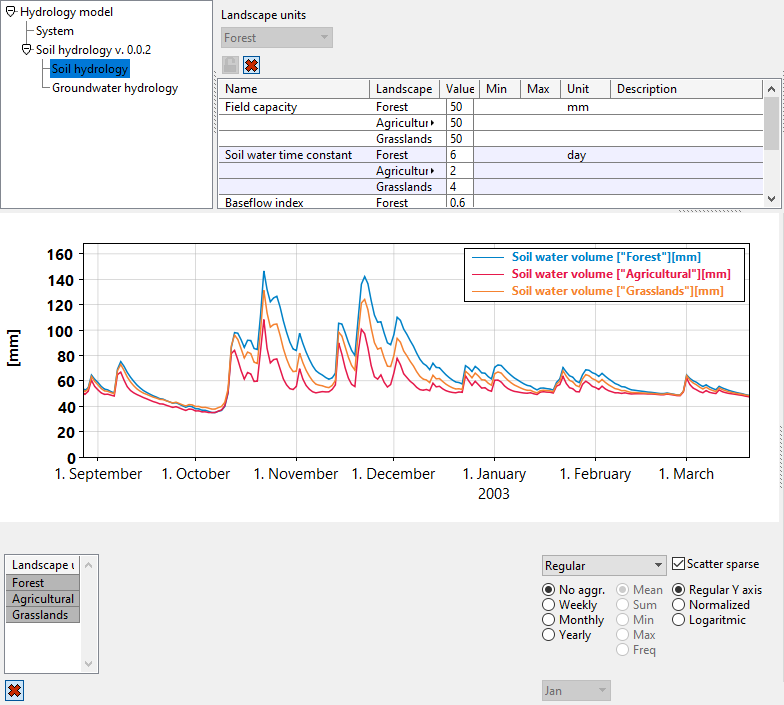
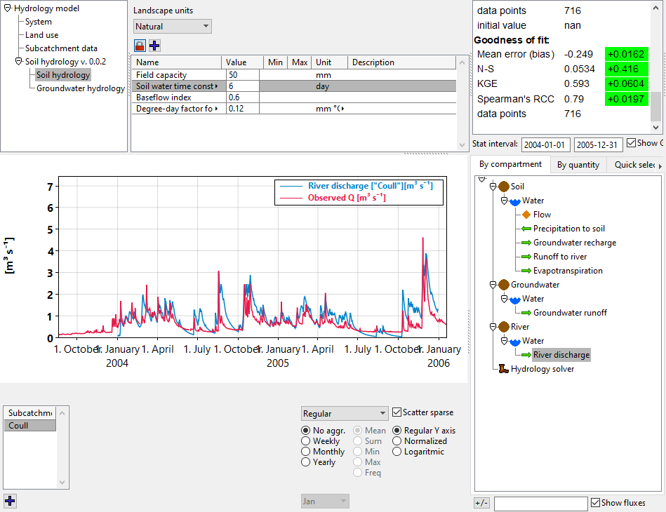

# Distribution and aggregation

Up to now, each state variable has only existed in one instance, but what if we want to e.g. describe multiple land patches that have the same mathematical description, but only have different parametrization?

In order to create multiple "copies" of the same parameters and state variables, we can distribute them over so-called index sets.

An index set is in itself nothing special, it is just a finite set of indexes (in a loose sense names) that can be used to distinguish between the copies.

State variables are not directly distributed, instead we can distribute compartments.

```python
# Declare the index sets
lu : index_set("Landscape units")
sc : index_set("Subcatchment")

# Distribute the compartments over index sets. Note that the `soil` indexes over both sc and lu,
# meaning that it gets a separate copy per pair of indexes from these two index sets
# (i.e. it indexes over the Cartesian product of these index sets).
soil   : compartment("Soil", sc, lu)
gw     : compartment("Groundwater", sc)
river  : compartment("River", sc)

# We let the atmosphere be uniform over the entire modeled area for now, hence we don't
# distribute it.
air    : compartment("Atmosphere")
```

If you only make this change to the model, you will notice in MobiView2 that the state variables are not actually distributed over the index sets. This is because Mobius2 makes optimizations where an index set is omitted from a state variable if it can be determined that the result series will not vary over that index set. 

Since we haven't distributed any parameters, all copies of the state variables would be the same, and so they are merged into just one copy each.

Inside the module we usually don't access index sets directly. Instead, we say that a parameter group can inherit index sets from one or more compartments. The reason for this is that you can then reuse the same module (once we have factored it to a separate file, which we will do in the next chapter) in different models that are allowed to distribute the compartments differently. For instance you could make a soil hydrology module that could be used both in semi-distributed and fully distributed models.

```python
# Let the soil hydrology parameter group index like soil
par_group("Soil hydrology", soil) {
	#...
}
```

Next, we have to modify the data set to provide values for each index copy. You could do this also by deleting the parameter group from the file, loading it in MobiView2 and saving it again. But it is instructive to do it manually, and it gives us more control over what index sets we want to use.

```python
# Declare the index sets at the top of the file, and fill them with something

lu : index_set("Landscape units") [ "Forest" "Agricultural" "Grasslands" ]
sc : index_set("Subcatchment") [ "Coull" ] # Just one subcatchment for now
```

```python
# You could let the group index over both lu and sc, but in the data set you are free to
# reduce the number of index set dependencies.
par_group("Soil hydrology", lu) {
	
	# Provide one parameter value per index
	par_real("Field capacity") 
	[ 50 50 50 ]
	#...
}
```

See the data format [documentation](../datafiledocs/new_project.html#parameter-groups) for a more detailed description of how to work with parameter group distributions in the data file.



You should now be able to see multiple parameters and state variables (Here we have clicked "Expand"  under both the parameter index selection and the plot index selection).

You may wonder how the "Recharge" flux between the soil water and the groundwater behaves when there are three land units, but the groundwater is only modeled using a uniform basin per subcatchment.

The answer is that the "Recharge" flux going out from each soil box is automatically summed into the single groundwater box.

This is nice and all, however, it is not technically correct for this particular model conceptualization. Since we are working with water volumes that are area-averages, the water from each soil box should be area-averaged when it is added to the groundwater box. For that we have something called an aggregation weight, which is declared in model scope.

```python
# Create a new parameter group (this time in model scope) with a parameter 
# where the user can provide the land use fraction for each soil unit.
par_group("Land use", soil) {
	f_lu : par_real("Land use fraction", [], 0, 0, 1)
}

# Tell the model to use this as an aggregation weight when summing fluxes 
# going from 'soil' to 'gw'. This just means that the value that is added
# to the target state variable is multiplied with the aggregation weight.
aggregation_weight(soil, gw) { f_lu }
# We will need it for the river too once we add that
aggregation_weight(soil, river) { f_lu }
```

In the example data set, we have set the land use fractions to something that fits the location the data is taken from.

Finally, we add a simple river module so that we can compare the model results to the river observations.

```python
module("River hydrology", version(0, 0, 1)) {
	
	var(river.water, [m 3], "River water")
	
	# Right now we haven't introduced the concepts necessary for one
	# river section to discharge to another, that will be explained
	# in a later guide.
	
	# Note how the flux doesn't need to have a unit that matches
	# the sampling step of the data set. The model will know on its own how to
	# convert the flux into the right scale. This also means that you can run
	# the same model with different sampling steps without making changes to
	# the model formulation!
	flux(river.water, out, [m 3, s-1], "River discharge") {
		# This is just a very simple example formula, and should not be used in practice.
		
		# Set the unit of w to dimensionless so that we don't get unit errors in the formula
		# (the formula is empirical, and so the units don't make sense).
		w := water=>[],
		0.01*w =>> # Set the unit back to the desired form
	}
}
#...
# Don't forget to solve the river water, or the river flow equation will be unstable!
solve(sol, soil.water, gw.water, river.water)
```

And also direct the soil and groundwater runoff to the river. Here we could make the soil hydrology module even more reusable by not specifying the runoff target directly and instead let the model determine it, but we do it in a simple way for now.

```python
flux(soil.water, river.water, [m m, day-1], "Runoff to river") #...
#..
flux(gw.water, river.water, [m m, day-1], "Groundwater runoff") #..
```

If you load the model now you will get an error. Since the river water has a different unit than the soil and groundwater, we must create another multiplier called a unit conversion

```python
# Another parameter group to hold subcatchment specific data
par_group("Subcatchment data", river) {
	A_c : par_real("Subcatchment area", [k m 2], 51.7) # Square kilometers
}

unit_conversion(soil.water, river.water) { A_c }
unit_conversion(gw.water,   river.water) { A_c }
```

Mobius2 will on its own scale the unit conversion so that the final units match. (That is, you don't have to worry about the fact that `1[m m]*1[k m 2] = 1e3[m 3]`, Mobius2 will figure out that it needs to multiply with the factor of `1e3` to make the units match up).



## Exercises

- Calibrate the model. Keep in mind that some of the process descriptions are very simple, so don't expect to get a perfect fit. Here are some tips:
	- In the beginning, Lock  the Landscape units index set when you edit the parameters since having separate parameters for each can be overwhelming when trying to create an initial fit. You can then unlock it later and provide separate parameters for more nuance if you want to.
	- See how the [goodness-of-fit statistics](../../mobiviewdocs/statistics.html) in the stat window change when you change a parameter and rerun the model. If the change is green, it means an improvement of that statistic.
	- If there is too much water in the river, increase the Degree-day factor for evapotranspiration.
	- If the flow peaks are too smoothed out, increase the Soil water time constant.
	- If the river empties too quickly during low flow, increase Groundwater time constant, and also experiment with the baseflow index.
- Improve the runoff and/or evapotranspiration fluxes by making them be smoother instead of turning on/off depending on water volume.

[Full code for chapter 04](https://github.com/NIVANorge/Mobius2/tree/main/guide/04).

## Distributing quantities

It is also possible to distribute quantities over index sets. By this, we mean distribute the quantity itself, not just compartments it is present in. This can be used to have several substances that behave according to the same principles, e.g. organic pollutants, and which are only parametrized differently.

