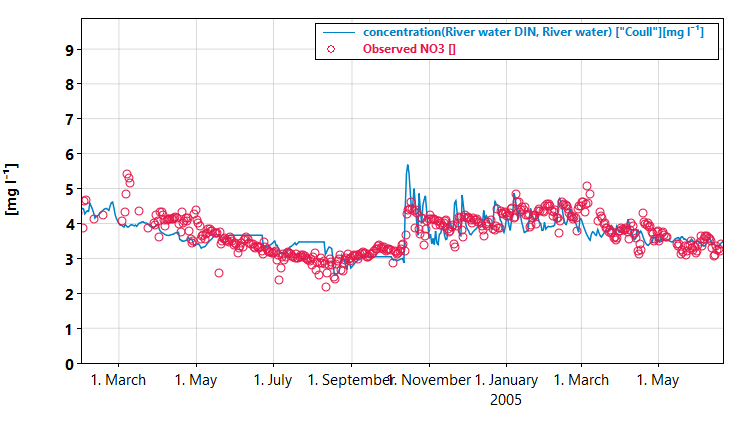

# Dissolved quantities

In this chapter we will talk about how you can use Mobius2's system for automatic transport of dissolved quantites, which makes it very convenient to make water quality models that are independent of the water transport.

## Interlude: Factoring out modules

Until now we have kept our modules inlined into the model file. This makes them quick to write, but ideally we want to specify the hydrology in separate modules so that you could reuse it for different water quality models, or even experiment with using different hydrology models for the same water quality model.

First, you cut and copy the hydrology modules over in a separate file (we have chosen "hydro_modules.txt", you can have multiple modules per file). Next, since the modules are no longer embedded in the model scope, they can't see any identifiers declared there, so you have to pass them as arguments when you load the modules. 

In the module itself, you declare the load arguments as follows

```python
module("Soil hydrology", version(0, 0, 3),
	air : compartment,
	soil : compartment,
	gw : compartment,
	river : compartment,
	water : quantity,
	temp : property,
	precip : property
) {
	# ...
}

module("River hydrology", version(0, 0, 2),
	river : compartment,
	water : quantity
) {
	# ...
}
```

This also provides a form of documentation about what entities the module is concerned. Later, it is possible to not pass `river` to "Soil hydrology", and instead just pass an arbitrary location target for the soil and groundwater runoffs, making it possible to connect these up in different ways without changing the module itself, but we will not cover that now.

Inside the model, you have to load the modules from their file, passing the load arguments.

```python
load("hydro_modules.txt",
	module("Soil hydrology", air, soil, gw, river, water, temp, precip),
	module("River hydrology", river, water))
```

We will have to make one small change to the soil hydrology inside "hydro_modules.txt": The evapotranspiration flux should not carry dissolved quantities. We do this by placing a `@no_carry` note on the flux declaration

```python
flux(soil.water, out, [m m, day-1], "Evapotranspiration") {
	pet := max(0, air.temp*ddfpet),
	0     if water < 0.7*fc,
	pet   otherwise
} @no_carry
```

Note that if you are only interested in developing your own water quality models, you could now switch to using a more finished hydrology model, like [SimplyQ](https://github.com/NIVANorge/Mobius2/blob/main/models/simplyq_model.txt).

## Dissolved quantities

Let's start with this chapter's main topic. As an example we will make a dissolved inorganic Nitrogen (DIN) model. Instead of including all fluxes like deposition, nitrification, fixation, denitrification, uptake and immobilisation, we will instead bundle these into a few sources and sinks.

Start by declaring our `in` quantity in model scope.

```python
in : quantity("Inorganic nitrogen")
```

Make a new module in e.g. "din_module.txt". We don't use all the load arguments yet, but we will soon. The declarations in the module will be explained shortly.

```python
module("DIN processes", version(0, 0, 1),
	air  : compartment,
	soil : compartment,
	gw   : compartment,
	river : compartment,
	water : quantity,
	in : quantity,
	temp : property
) {
	par_group("Land specific DIN", soil) {
		init_din : par_real("Initial soil DIN concentration", [m g, l-1], 4)
	}
	
	var(soil.water.in, [k g, m-2], [m g, l-1], "Soil water DIN") @initial_conc { init_din }
	
	var(gw.water.in, [k g, m-2], [m g, l-1], "Groundwater DIN") @initial_conc { 0[m g, l-1] }
	
	var(river.water.in, [k g], [m g, l-1], "River water DIN") @initial_conc { 0[m g, l-1] }
}
```

Don't forget to load it in the model

```python
load("din_module.txt",
	module("DIN processes", air, soil, gw, river, water, in, temp))
```

When you have a `var` with a *location* like `soil.water.in` that consists of a quantity `water` followed by another quantity `din` we say that the second quantity is *dissolved* in the first. When the `var` is declared, we can provide two units for it. The first is the mass (or volume) unit, and the second the concentration unit.

The concentration unit must always be [convertible](../units.html#conversion) to the mass unit divided by the unit of the water (or whatever quantity you dissolve in). For instance, in our soil DIN example, the mass unit is `[k g, m-2]`, the concentration unit is `[m g, l-1]`, and the water unit is `[m m]`. Since

$$
\frac{\mathrm{kg}}{\mathrm{m}^2\cdot mm}
$$

can be converted to $$\mathrm{mg}/\mathrm{l}$$ with a factor of $$10^{-6}$$, this works. Mobius2 will internally compute the conversion factors, so you don't need to worry about that.

The `@initial_conc` note is similar to `@initial`, but instead of the initial mass you provide the initial concentration. Mobius2 computes the initial mass of the variable by multiplying the initial concentration with the initial volume of water (and the appropriate scaling factor).

Note how we haven't explicitly done a `solve()` declaration to make the model treat the new variables as ODE variables. This is because any quantity is automatically given the same solver as what it is dissolved in.

If you run the model now, you will notice how you get a nonzero concentration of DIN in the groundwater and river even though you didn't explicitly put any there. This is because all fluxes in Mobius2 will automatically transport dissolved quantities. Aggregation will also be applied in a similar way. This means that all you runoff and discharge fluxes will carry DIN proportionally to the concentration in the source compartments.

The concentration currently drops off quickly. This is because any new water coming in (precipitation) doesn't carry DIN, and so this clean water replaces the water with DIN over time. Let's provide some DIN sources to ameliorate it

```python
par_group("DIN global") {
	din_in   : par_real("Non-agricultural DIN inputs", [k g, ha-1, year-1], 5)
	din_loss : par_real("DIN loss rate at 20°C", [day-1], 0.01)
	din_q10  : par_real("DIN loss response to 10°C change in temperature", [], 2)
}

flux(out, soil.water.in, [k g, m-2, day-1], "Soil water DIN deposition and fixation") {
	din_in/365[day, year-1] ->>
}

flux(soil.water.in, out, [k g, m-2, day-1], "Soil water DIN loss") {
	in*din_loss*din_q10^((air.temp-20[deg_c])/10[deg_c])
}
```

The loss rate follows a simple [Q10](https://en.wikipedia.org/wiki/Q10_(temperature_coefficient))-like process where it is higher with higher temperatures. This is common because it is typically driven by plant uptake and microbes that are more active during higher temperatures. Ideally this should follow soil temperature and not air temperature, but we won't make a soil temperature module in this tutorial.

Feel free to experiment with different formulations, adding removal processes in the groundwater and river if you want to. Also experiment with how changing the hydrology will affect river DIN concentrations.

As a final example, we will provide you with an example of a timed process of fertilizer addition.

```python
# Fertilization is land-specific since you want to be able to turn it off for
# non-agricultural land types
par_group("Land specific DIN", soil) {
	init_din : par_real("Initial soil DIN concentration", [m g, l-1], 4)
	din_fert : par_real("Fertilizer IN addition", [k g, ha-1, day-1], 100)
	fert_day : par_int("Fertilizer addition day", [day], 150)
	diss     : par_real("Fertilizer N dissolution rate", [m m-1], 0.01)
}

# ...

var(soil.in, [k g, m-2], "Soil fertilizer N")
	
flux(out, soil.in, [k g, m-2, day-1], "Soil fertilizer N addition") {
	din_fert->>     if time.day_of_year = fert_day,
	0               otherwise
}

flux(soil.in, soil.water.in, [k g, m-2, day-1], "Fertilizer N dissolution") {
	soil.in * diss * in_flux(water)
}
```

Here we add fertilizer N to `soil.in`, which represents N that is not yet dissolved into the soil water. The `time` structure contains several variables that can [tell you what the model time is](../math_format.html#identifier).

The fertilizer N is then slowly dissolved into the soil water proportionally to the amount of water entering the soil (if you use the hydrology module from the previous chapters, that is only precipitation, but it could also include e.g. snow melt in other hydrology modules). The `in_flux` directive sums up all incoming fluxes of the given quantity.

[Full code for chapter 05](https://github.com/NIVANorge/Mobius2/tree/main/guide/05).



The calibration is far from perfect, but we can capture some of the main features of the signal.

## Exercises

- Try to match the calibration in the image above.
- Modify the code to add fertilizer between a range of dates instead of at a single date.
- Create a time series input for N deposition.
- The current groundwater compartment in the hydrology model is only suitable for very shallow groundwater. Add in a retention volume so that the effective retention time of the groundwater is longer. Also add in an initial groundwater DIN concentration. (The result of this will be that the concentration of dissolved quantities in the groundwater will have a smoother signal and not respond as quickly to changes in the soil concentrations).
- Make two separate quantities `no3` and `nh4` and make a nitrification flux between `soil.water.nh4` and `soil.water.no3` etc.

