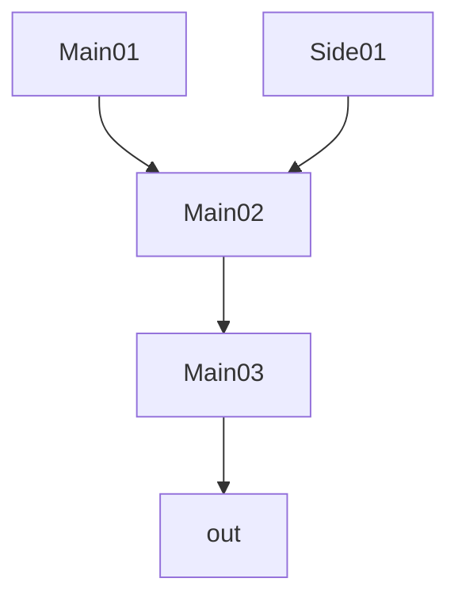
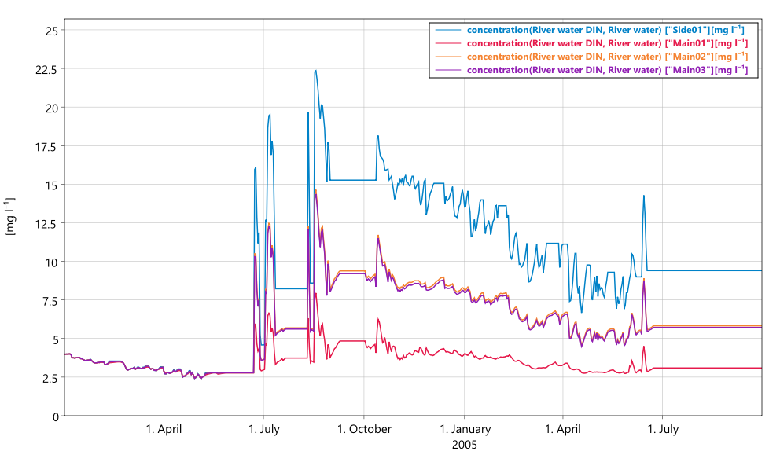

# Graph connections

Until now we have learned how to direct fluxes between different types of compartments, but what if you want to direct fluxes between different instances of the same compartment type?

The example we will look at today is how to make river sections discharge to other river sections.

The general mathematical object describing arrows going between different nodes is that of a [directed graph](https://en.wikipedia.org/wiki/Directed_graph). In Mobius2 you can use `directed_graph` *connections* to describe arbitrary flow graphs of e.g. rivers, lakes, soil patches, hydraulic units, etc.

We start by declaring the connection entity in the model scope

```python
downstream : connection("Downstream") @directed_graph {
	# Don't worry too much about this regex for now, it is experimental
	# functionality. It says that any path in the graph must be one or
	# more river sections followed by an 'out'
	river+ out
} @no_cycles
# '@no_cycles' just declares that instances of this connection should not contain circles.
```

The specific graph is specified in the data set for the specific model application. This time we don't follow a real-life location, so this setup is fictional.

Let's resize the "Subcatchment" index set so that we can have four river sections.

```python
# Remember, the names of the river sections can be whatever you want,
# the naming we use here is just illustrative.
sc : index_set("Subcatchment") [ "Side01" "Main01" "Main02" "Main03" ]
```

Remember to also resize parameter groups that index over the subcatchment:

```python
par_group("Land use", sc, lu) {
	
	par_real("Land use fraction") [
		0 1 0 
		0.5 0.2 0.3 
		0.3 0 0.7 
		0.2 0.5 0.3 
	]

}

par_group("Subcatchment data", sc) {
	
	par_real("Subcatchment area") 
	[ 51.7 20 30 40 ]

}
```

Next, we want to connect the "Downstream" connection so that the three main branches follow one another, while the side branch enters the second main branch as illustrated in the below diagram.



We do this using the following syntax.

```python
connection("Downstream") {
		
	r : compartment("River", sc)
	
	directed_graph [ 
		r[ "Main01" ] -> r[ "Main02" ] -> r[ "Main03" ] -> out
		r[ "Side01" ] -> r[ "Main02" ]
	]
}
```

We declare that we refer to the "River" compartment using the identifier `r`, and index it over the subcatchment `sc`. Any arrow `->` between two nodes creates a connection between these.

As this connection is set up, each river section is only allowed to have one outlet. We may cover how to handle multiple outgoing arrows in another chapter (but that is not as relevant for rivers).

Finally, when we load the "River hydrology" module we must pass the downstream connection as the discharge target of the river.

```python
load("../05/hydro_modules.txt",
	module("Soil hydrology", air, soil, gw, river, water, temp, precip),
	module("River hydrology", river, water, loc(downstream)))
```



In the example data set, the concentration of DIN in the branch "Main02" is high even though the agricultural land use fraction in this subcatchment is low. This is because the agricultural land use fraction in the subcatchment of "Side01" is very high, and the "Side01" branch discharges to "Main02".

[Full code for chapter 06](https://github.com/NIVANorge/Mobius2/tree/main/guide/06).

## Exercises

- If you have your own study catchment, set up the model for it.
- Modify the hydrology model to have multiple soil compartments (indexed over a new index set) that discharge to one another.

