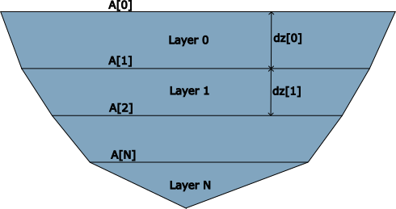
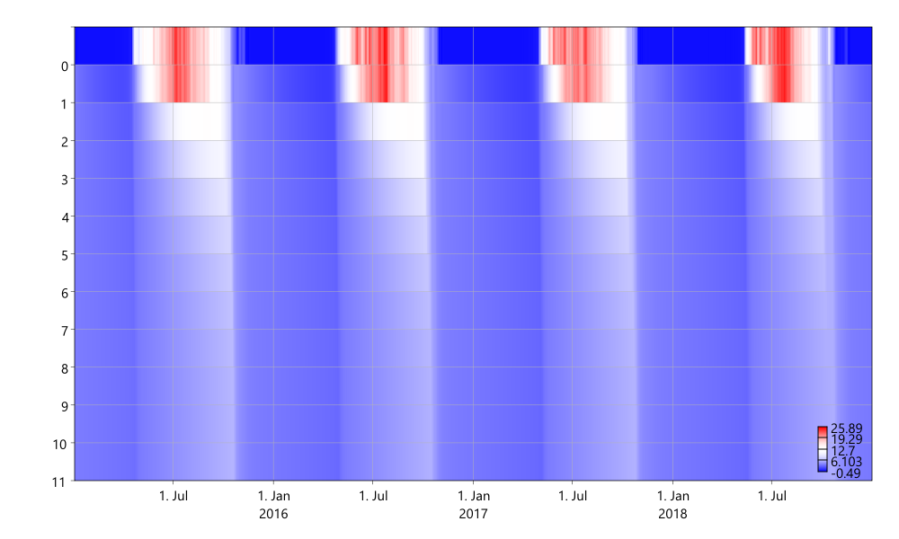

# Simple layered lake

In this chapter we will set up the model complexity a notch and work with a 1-dimensional model of a lake. That it is 1-dimensional means that we will consider the state of the lake (temperature, various concentrations, etc.) to be homogenous across each horizontal layer for any given depth $$z$$, but will vary as you vary $$z$$. 1-dimensional models are often good approximations for smaller lakes.

We will base ourselves on a simplified version of the formulation of the MyLake model \[SalorantaAndersen07\]. In this first chapter we will just make a basin with precipitation inputs and discharge outputs. It will not be connected to a catchment that it receives river discharge from yet. The power of Mobius2's ability to couple different modules will be shown in the next chapter, where we will connect the lake to our existing catchment model. The biochemistry of the lake will also be added in a later chapter, for now we will just consider water balance and heat transfer.

We will not give as detailed a description of all the model code in this chapter as we have done in previous chapters, instead we will just highlight what is new.

## 1-dimensional grids

The main Mobius2 feature we are showing off with the lake module is the 1-dimensional grid connection. This is a connection that arranges the instances of a compartment (in our case lake layers) in a linear order, and allows us to reference an instance immediately `below` or `above` a given instance or the instance at the `top` or `bottom` of the order.

In Mobius2, the `top` of the grid is just a name for the first index, while the `bottom` is the last index, but for convenience we will organize the lake model so that these coincide with the physical top and bottom layers of the lake.

Instead of rewriting everything from scratch, we will reuse the existing "AirSea" and "Atmospheric" modules in Mobius2. These deal with computing various types of radiation, as well as air-lake heat exchange and evaporation.

Our lake will be divided into several `layer` compartments, that are indexed over a `layer_index` index set, and are connected along a `vert` (vertical) connection.

```python
layer_idx : index_set("Layer index")
	
lake  : compartment("Lake")
layer : compartment("Lake layer", layer_idx)

vert    : connection("Lake vertical") @grid1d(layer, layer_idx)
sw_vert : connection("Shortwave vertical") @grid1d(layer, layer_idx)
```

Note that we have also defined a compartment called `lake` which is a convenient place to put state variables that are the same for the entire lake (such as things that only pertain to the lake surface, like ice). We have also added a separate vertical connection for shortwave radiation. This is just a technical solution that allows us to separately track transfer of shortwave heat energy from other transfer of heat energy along the vertical connection.

For the parametrization of the lake, we allow every lake layer to have a separate surface area and thickness with the top layer having varying thickness depending on water level.



Figure: Conceptual diagram of the lake model. The lake is divided into layers, with thickness `dz` (potentially different per layer). The area of the top of a layer is `A`, while the area of the bottom of the layer is the top area of the layer below it. Thus the volume of a layer is `0.5*(A + A[vert.below])*dz`, where `A[vert.below]` signifies the area in the layer below the one we are currently looking at.

## Turbulent mixing

The most important concepts in lake hydrodynamics are temperature-based stratification and turbulent mixing (as well as ice formation and melt). When the surface temperature is different from the bottom temperature of the lake, the top layers will have lower density, and more energy is needed to mix them with lower layers, hence you will often see stratification of lakes during summer where top and bottom layers are not mixed with one another. This is important for different reasons since it causes e.g. varying retention times in the lake, depletion of oxygen at lower layers, and many other things.

The lake is mixed by turbulent mixing energy, which often is caused by wind acting by friction on the lake surface. However full models for transfer of turbulent energy are very complex, and we will not model that here. We will also not use any explicitly wind-driven mixing yet and instead use an empirical formulation where the mixing rate only depends on the so-called [Brunt-Väisälä frequency](https://en.wikipedia.org/wiki/Brunt%E2%80%93V%C3%A4is%C3%A4l%C3%A4_frequency) $$N(z)$$, given by

$$
N(z)^2 = \frac{g}{\rho(z)}\frac{\partial\rho(z)}{\partial z}.
$$

Here $$g$$ is the gravitational accelleration at Earth surface, and $$\rho(z)$$ is the density of water at depth $$z$$ (depending on temperature, using a standard formula). The last differential term is approximated as a finite difference of the density at the center of the current layer and the one below divided by the distance between the centers. Since we are going to divide by this value later, we also need to set a lower bound for it.

```python
var(layer.water.N2freq, [s-2]) {
	# The distance between the center of two neighboring layers is the same 
	# as the mean of their thicknesses
	mdz := 0.5*(dz + dz[vert.below]),
	# A finite difference approximation of d(rho)/dz
	drho_dz := (rho[vert.below]-rho)/mdz,
	N2  := (grav/rho) * drho_dz,
	# For numerical reasons that will be apparent below, we can't allow N^2
	# to be too close to 0.
	max(N2min, N2)
} @no_store
```

Note how we can reference a value below us along a `grid1d` connection by using a square bracket.

The `@no_store` directive just tells Mobius2 to not store the time series of this variable. This can be useful for a couple of reasons
	- It saves memory. This is especially important for variables in compartments that are distributed over large index sets.
	- Too many variables can clutter up the user interface, and not all of them are interesting in themselves.

The mixing coefficient $$K$$ is (as in MyLake) be given by

$$
K_r = \begin{cases}
K_0 A^{0.56} & \text{If there lake is ice free}\\
K_{0,ice}    & \text{otherwise}
\end{cases},\\
K = K_r N^{2\alpha}
$$

Here $$A$$ is the lake surface area, $$K_0$$, and $$K_{0,ice}$$ are configurable parameters (but with good default values), and $$\alpha=-0.43$$ is a constant.

The mixing rate of a layer $$i$$ with the one below it is then

$$
\frac{K A_{i+1}}{\frac{1}{2}(dz_i + dz_{i+1})}
$$

This is formulated in Mobius2 as

```python
flux(layer.water, vert, [m 3, day-1], "Layer mixing down") { 
	mdz := 0.5*(dz + dz[vert.below]),
	K*A[vert.below]/mdz->>
} @mixing
```

The `@mixing` note tells Mobius2 that this flux happens in both directions so that the net exchange of water between the two layers is zero, but that it should still cause mixing of dissolved substances (this includes heat energy). In practice, the ODE system that is generated from this is mathematically equivalent to the finite element discretization of the diffusion equation described in \[SalorantaAndersen07\].

## Surface fluxes, ice and heat

The exchange of heat energy between the lake surface and the atmosphere is entirely taken care of by the AirSea module. It also takes care of ice growth and melt, and it computes evaporation. We won't go into detail about that here. Just note that we model `layer.water.heat` as a dissolved variable, then compute temperature from the heat density (concentration).

This module also takes care of the water and heat balance connected to direct precipitation inputs to the lake surface and evaporation.

## Shortwave radiation

Unlike other heat fluxes, shortwave radiation can be passed down through multiple layers. The AirSea module is loaded in a way that specifies the surface incoming shortwave radiation to be passed to the top layer of the lake along the `sw_vert` connection. This is because the location target for the shortwave is specified as `loc(layer.water.heat[sw_vert.top])` (see the load arguments for AirSea in the model).

Doing it this way, we can access the amount of incoming heat along this connection and pass some of it along to connections below. The amount of `heat` coming to the `water` along the `sw_vert` connection can be accessed using `in_flux(sw_vert, water.heat)`.

```python

# We store layer.sw as a separate variable because it can be used 
# in biochemical modules for light availability for plankton etc.
var(layer.sw, [W, m-2], "Layer shortwave radiation") {
	in_flux(sw_vert, water.heat)/A ->>
}

# This flux sends non-attenuated shortwave energy to the layer below it.
flux(layer.water.heat, sw_vert, [J, day-1], "Shortwave shine-through") {
	sw*(1 - attn) * A[vert.below] ->>
}

# The fraction of shortwave going to the sediments is currently a sink.
# It would be better to add a separate sediment compartment per layer 
# and have some heat exchange model for it so that if it is warm, it 
# releases some heat back to the water.
flux(layer.water.heat, out, [J, day-1], "Shortwave to sediments") {
	sw*(1 - attn) * (A - A[vert.below]) ->>
}

var(layer.water.attn, []) {
	cz := max(0.01, refract(air.cos_z, refraction_index_water)),
	# Length traveled through the layer by a sun beam taking zenith angle into account.
	th := dz / cz,
	1 - exp(-att_c*th)
}
```

The ligh attenuation uses a constant light extinction coefficient `att_c` (parameter). When we add biochemistry, we can make it depend on particle and DOC density in the lake.

## Water balance and discharge

We add discharge from the lake top layer. This is important even though we haven't connected the catchment yet, because otherwise precipitation alone would make the lake volume go up over time.

There are many ways one could do the lake water balance, for instance one could distribute water so that all layers have the same thickness as one another. But in this example we have opted for a much simpler solution where only the top layer changes in thickness while the others stay constant. Of course, this may not be as good for reservoirs where the level could vary by many meters, but it works for a non-regulated lake where the surface level stays fairly constant.

```python
flux(layer.water, out, [m 3, s-1], "Layer discharge") {
	# Exercise: Take into account that the top area would expand if 
	# the water expanded, along the same shore shape.
	a := 0.5*(A + A[vert.below]),
	dz_est := water / a,
	
	# Exercise: The rating curve should maybe be nonlinear
	excess := max(0, dz_est - dz),
	rate_c := 1[m 2, s-1],
	rate_c*excess
}
```
(Right now this flux code is run for all layers, but will be 0 for all but the top layer since the other layers don't have any water sources to them, and so they don't change thickness. There is a limitation in the framework that don't allow us to specify this flux for the top layer only, but we plan to fix it).



Figure: A [MobiView2 heatmap plot](../../mobiviewdocs/plots.html#heatmap) of the lake temperature in the various layers over time. Note that the y axis of the plot denotes layer index rather than depth. We will show how to make it denote depth in a later chapter.

## Full code and example data

The data set example has been set up with real observations for lake Langtjern (lat: 62.7 lon: 8.9), a small lake in a boreal catchment in southern Norway.

It is not meaningful to compare model results with observations yet because the temperature of the water coming from the catchment has a large impact on the lake temperature, and that inflow is not added yet.

[Full code for chapter 07](https://github.com/NIVANorge/Mobius2/tree/main/guide/07).

## Exercises

- Add a sediment compartment per layer and a heat exchange model between the sediments and water.
- Make the code that computes the thickness of the top layer take into account that the surface area of the top layer would expand when the thickness increases.
- Make a better rating function for the lake discharge.

## Citations

\[SalorantaAndersen07\] MyLake - A multi-year lake simulation model code suitable for uncertainty and sensitivity analysis simulations, Tuomo M. Saloranta and Tom Andersen 2007, Ecological Modelling 207(1), 45-60, [https://doi.org/10.1016/j.ecolmodel.2007.03.018](https://doi.org/10.1016/j.ecolmodel.2007.03.018)

