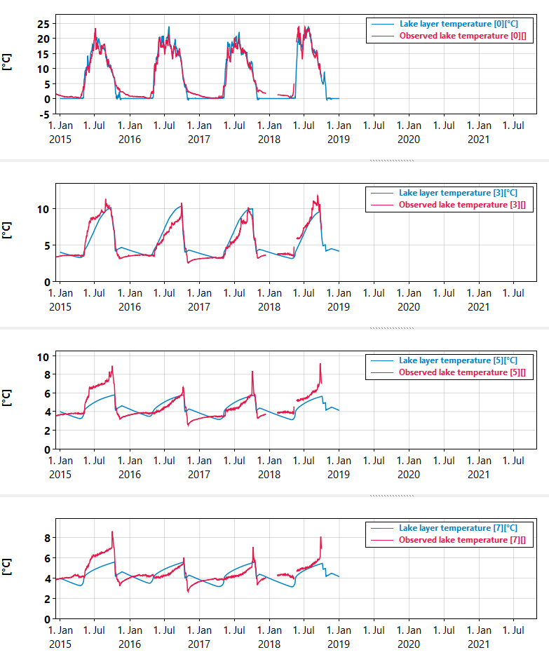

# Lake with catchment

In this chapter we couple the hydrology modules from previous chapter to our new lake model. This allows us to simulate a combined catchment-river-lake system.

## Cold open: The snow layer

Since our example model setup for this model is in a Norwegian location, it now becomes quite important to have a snow module. The snow module stores winter precipitation as snow until temperatures rise again, whereupon it melts and goes to the soil water.

For simplicity we implement the snow module as a discrete step system instead of an ODE system. This means that instead of integrating the system using a solver, every flux is just subtracted from its source and/or added to its target once per model time step (when that source or target is not ODE).

```python
# A snippet of snow_module.txt


# In the below equations we make use of the auto-conversion from boolean 
# to real value types. For instance the expression
# (air.temp <= 0)
# is of type boolean, but converts to real when multiplied with the 
# other real value air.precip. The effect is that the expression is 0 when 
# (air.temp<0) and 1 when (air.temp>=0) so that the precipitation is added
# to the snow box when (air.temp) < 0 only.

p_snow :
flux(out, snow_box.snow, [m m, day-1], "Precipitation falling as snow") {  air.precip * (air.temp <= 0)  }

p_rain :
flux(out, soil.water, [m m, day-1], "Precipitation falling as rain")  {  air.precip * (air.temp > 0)  }

melt :
flux(snow_box.snow, soil.water, [m m, day-1], "Melt") {   max(0, ddf_melt*air.temp)   }

# Since these fluxes are not solved as ODE, we need to specify what order they go in
discrete_order {
	p_snow
	melt
}
```

In this model we have decided not to solve `snow_box.snow` on a solver, and so it counts as a discrete variable. Since the addition of snow from snow fall and subtraction from melt happen once per step, it becomes important in what order they happen. The purpose of the `discrete_order` block is to declare that order.

The framework automatically checks that a discrete flux can't overtax its source, so for instance the "Melt" flux can't make `snow_box.snow` go negative even though it looks like it could if you only consider the math expression for it.

See more about discrete fluxes under [advanced concepts](../advanced_concepts.html#discrete-fluxes)

## Adding a catchment to our lake model

Instead of making a copy of the lake model file and editing it, we now `extend` it. This makes it so that changes to the original model also take effect in the one extending it, and we don't have to keep track of too many model versions.

```python

model("Lake model with catchment") {

	extend("../07/07_model.txt")
	
	#...
}
```

The `extend` declaration pulls all declarations from the other model into the main scope of the current model. Thus it behaves a little differently to module loads, which create their own scopes.

We then load the hydrology modules from previous chapters, but put in our new snow module. We also add the aggregation weights and unit conversions. This is the same as before, so we will not describe it again.

To get lake temperatures correct, we also need river water to carry heat energy. For this, we load modules from the main Mobius2 model ecosystem, as their implementation details are not sufficiently interesting to cover here.

```python
load("modules/simplysoiltemp.txt", module("Simply soil temperature", air, soil, snow_box, snow, temp))
load("modules/rivertemp_o2.txt", module("RiverTemperature", air, soil, river, water, heat, temp))
```

To connect the catchment to the lake we make a new "Downstream" connection

```python
downstream : connection("Downstream") @directed_graph {
	river+ layer
}
```

This connection allows both river segments and lake layers to be part of the connection.

In the data file, we connect them as follows

```python
li : index_set("Layer index") [ 12 ]
	
sc : index_set("Subcatchment") [ "LAE03" "LAE_rest" ]

lu : index_set("Landscape units") [ "Forest" "Peat" ]

connection("Downstream") {
	
	r : compartment("River", sc)
	l : compartment("Lake layer", li)
	
	directed_graph [ 
		r[ "LAE03" ] -> l[ 0 ]
		r[ "LAE_rest" ] -> l[ 0 ]
	]
}
```

Note that "LAE03" is a sub-catchment of the larger lake catchment where we have discharge and DOC data for the stream. This will help with the calibration.

We see that we have coupled both of our sub-catchments to discharge to the surface layer of the lake. In reality, cold snow melt water in the spring may sink deeper after the surface layer of the lake starts heating up, and not mix entirely with the surface water. It is possible to implement this, but we will not cover it here.

It is also possible to have multiple lakes with a branched river structure between them (or even direct exchange between coupled lake basins), but again this is not covered in this tutorial.

## Calibration and results



Figure: Simulated and observed temperatures at depths of 0, 3, 5, and 7 meters.

The tempereture results are decent considering that we don't take into account effects like wind driven mixing.


Figure: Observed and simulated ice indicator (the value is 1 if there is ice cover).

The timing of ice cover starting and lifting is correct within less than 10 days in all years except in the autumn of 2017 (not taking into account the 1 day of simulated ice cover in November 2018).

**This chapter is incomplete. Remaining:**
* More precise calibration of the catchment
* Describe how to calibrate lake temperature and ice

[Full code for chapter 08](https://github.com/NIVANorge/Mobius2/tree/main/guide/08).
