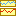

# The additional plot view

From the toolbar you can open an additional window  to display multiple plots at the same time.

In the top you can select how many plots are to be shown ("Rows"), and if the x axes of the plots are to be linked. You can also select an "Override mode" to force a single plot mode for all the plots.

For each row you can
- Push the `<<` button to copy the plot setup from the main window to the local one.
- Push the `>>` button to copy the local plot setup back to the main window.

Each row also has its own [statistics window](statistics.html) that uses the same goodness-of-fit interval as the main window.

Like the main plot, these also update whenever you run the model.

This window has a toolbar with two buttons on its own
- Save. You can store the current plot setup to a file.
- Load. You can load the current plot setup from a saved file. Note that the actual time series data will be from the current model run, not the one that was active when the setup was stored. Only the actual plot setup (i.e. name of time series, indexes, plot mode etc.) is stored and loaded.
