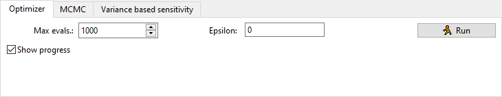

# Autocalibration

Autocalibration can be used to make MobiView2 try to figure out the best set of parameter values to optimize a chosen statistic.

The setup of parameters and targets uses the [common setup](sensitivity.html#the-common-setup).

Note that the optimizer is not magical, so if the problem is hard it can struggle to find the best solution. You should help it along by trying to keep the parameter space as small as possible, both by constraining the parameter ranges, but more importantly by optimizing as few parameters as possible at the same time.

We use the [dlib global optimization algorithm](http://dlib.net/optimization.html) \[King09\].

All the (goodness-of-fit statistics)[statistics.html#goodness-of-fit] are available for optimization. The statistics MAE and RMSE will be minimized, the others maximized. You can not mix targets that should be minimized with targets that should be maximized. All targets have to have an input comparison series for it to be able to evaluate the error of the modeled series compared to the input observed series.

You can also optimize the [MCMC likelihood functions](mcmc.html#likelihood-structures) and use that as a starting point for a MCMC run. Unless you use a likelihood function, you should ignore the "error param(s)" field in the target setup.

You can set the maximal number of times the optimizer is allowed to evaluate the model (max. evals.). It will usually use all of these. The higher number, the better result, but also longer run time. The total time of the optimizer is roughly equal to the time to run one model multiplied with the number of evaluations.

Epsilon: According to the [dlib documentation](http://dlib.net/dlib/global_optimization/find_max_global_abstract.h.html#find_max_global),

> the search will only attempt to find a global
> maximizer to at most epsilon accuracy.  Once a local maximizer is
> found to that accuracy the search will focus entirely on finding other maxima
> elsewhere rather than on further improving the current local optima found so
> far.  That is, once a local maxima is identified to about epsilon
> accuracy, the algorithm will spend all its time exploring the functions to
> find other local maxima to investigate.  An epsilon of 0 means it will keep
> solving until it reaches full floating point precision.  Larger values will
> cause it to switch to pure global exploration sooner and therefore might be
> more effective if your objective function has many local maxima and you don't
> care about a super high precision solution.

The main parameter set (that is loaded in memory) is replaced with the new best parameter set when the optimization run is finished (this does not overwrite your file unless you save ).

If you have the "show progress" box ticked, it will periodically show how many evaluations it has done and what is the best current value of the (compound) target statistic compared to the initial value of the statistic. If you also have the [additional plot view](additionalplots.html) open with the targeted time series (click the  "Target plots" button), it will update the plot of these.

One tip is to save baseline  before you start the run, then have the additional plot view open with "override mode" set to "Compare baseline". This allows you to see how the current best fit of the optimizer compares to what you had at the outset. You can then also revert to baseline  after the optimization if you are not satisfied.

## Citations

\[King09\] Davis E. King, *Dlib-ml: A Machine Learning Toolkit*. The Journal of Machine Learning Research, 10, 1755-1758, [http://doi.org/10.1145/1577069.1755843](http://doi.org/10.1145/1577069.1755843), 2009