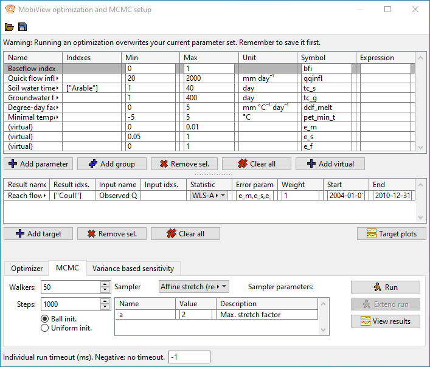

# Markov Chain Monte Carlo

You can sample the posterior distribution of the parameter space using Markov Chain Monte Carlo (MCMC) methods. This is one of the best ways to sample both uncertainty and sensitivity of the parameters. See these [Statistics notes for environmental modelling](https://github.com/JamesSample/enviro_mod_notes) for a more comprehensive introduction to running MCMC with environmental models.

The setup of parameters and targets uses the [common setup](sensitivity.html#the-common-setup).

The prior distribution of each parameter is assumed to be uniform over the min-max interval. The parameter chains can be initialized either uniformly or using a small gaussian ball around the current parameter values (in the main dataset). The MCMC run usually performs better if you use the optimizer (or manual calibration) to find an optimal starting place, then initiating MCMC using the gaussian ball.

You may need a high number of walkers to get good performance (think 50-100 or more depending on parameter space complexity).

## Likelihood structures

For MCMC the targets have to be set up using a formal Bayesian likelihood structure. Each of the likelihood structures require one or more error parameters that are sampled along with the model parameters. The error parameters have to be manually added in the parameter view using  "Add virtual". You can give the error parameters what symbol you like, but have to list what symbol is the error parameter for what likelihood structure in the "error param(s)" field in the target setup. If a structure requires more than one error parameter, you have to list the symbols as a comma-separated list (they have to be in the same order as given in the below table.

Let $$\{o_i\}_i$$ and $$\{m_i\}_i$$ be observed and modeled series respectively, and let $$\epsilon_i=o_i-m_i$$ be the residual at time point $$i$$. The assumption we make is that there exists a series $$\{y_i\}_i$$ of independently distributed standard normals (mean 0, standard deviation 1) called the *standard residuals* that is related to the actual residuals as given in the table below (depending on what structure is chosen).

| **Name** | **Error structure** | **Error parameters** |
| -------- | ------------------- | -------------------- |
| **Normal** | $$\epsilon_i = \sigma y_i$$ | $$\sigma$$ |
| **Normal hetereoskedastic (1)** | $$\epsilon_i = (\sigma m_i) y_i$$ | $$\sigma$$ |
| **WLS** \[Evin14\] | $$\epsilon_i = (\mu + \sigma m_i) y_i$$ | $$\mu$$, $$\sigma$$ |
| **WLS-AR1** \[Evin14\] | $$\epsilon_i = (\mu + \sigma m_i)\eta_i,\, \eta_i = \phi\eta_{i-1}+y_i$$ | $$\mu$$, $$\sigma$$, $$\phi$$ |

Table: Likelihood structures available in MobiView.

In Normal hetereoskedastic, WLS and WLS-AR1 the residuals are assumed to have a standard deviation that is proportional to the modeled value (called hetereoskedasticity) (see \[Evin14\] for the latter two). WLS-AR1 adds autoregression so that the residuals are no longer independent. This is because an error at one point in time is often correlated with the error in the previous time step. This structure is usually very good at reducing autocorrelation in the standard residuals, but could be a bit slower to converge due to the larger parameter space.

There are plots in the MCMC result view (under "Result projections") that can help you determine if the standard residuals are normally distributed and have acceptable autocorrelation. (This should not be confused with the chain autocorrelation in the Parameter distribution summary).

## Samplers

You can select between the following samplers (MCMC algorithms). We don't document them here, so you need to look up the cited paper if you want to understand them better.

- **Affine stretch**. The main affine-invariant ensemble sampler described in \[GoodmanWeare10\] and \[ForemanMackey13\]. This is the sampler that (in our experience) performs best on water quality and hydrological models. 
- **Affine walk** Another affine-invariant sampler from \[GoodmanWeare10\].
- **Differential evolution**. See \[TerBraak06\]. This is historically another popular choice for environmental models.
- **Metropolis-Hastings**. This is the original MCMC algorithm \[Hastings70\]. It is included mostly for comparison since it is not powerful enough to converge quickly in most practical applications. If you run multiple chains, they will be independent of one another (but this still allows you to leverage parallellism for a speedup). In this implementation the standard deviation of each step is proportional to the length of each parameter interval. This means that you have to do some fine tuning of these intervals to get a good acceptance rate.

There is no simple formula to determine how best to tune the samplers, so you experiment with it, but usually the default sampler parameters work well.

## The result view

The result view allows you to

- View plots of the chains (the parameter value attached to each worker) as they are progressing.
- View a triangle plot of the posterior distribution.
- View various statistics about the posterior distribution, along with the acceptance rate for the MC step.
- View projected outcomes and the standard residuals (including autocorrelation of standard residuals).

More detailed documentation of the result view is forthcoming.

## Citations

\[Evin14\] Guillaume Evin et. al., *Comparison of joint versus posterior postprocessor approaches for hydrological uncertainty estimation accounting for error autocorrelation and hetereoscedasticity*. Water Resources Research, 50, 2350-2375, [https://doi.org/10.1002/2013WR014185](https://doi.org/10.1002/2013WR014185), 2014

\[GoodmanWeare10\] Jonathan Goodman and Jonathan Weare. *Ensemble samplers with affine invariance*. Communications in Applied Mathematics and Computational Science, 5(1), 65-80, [http://doi.org/10.2140/camcos.2010.5.65](http://doi.org/10.2140/camcos.2010.5.65), 2010

\[ForemanMackey13\] Daniel Foreman-Mackey et. al., *emcee: The MCMC hammer*. Publications of the Astronomical Society of the Pacific, 125, 306-312, [http://doi.org/10.1086/670067](http://doi.org/10.1086/670067), 2013

\[TerBraak06\] Cajo J. F. Ter Braak. *A Markov Chain Monte Carlo version of the genetic algorithm Differential Evolution: easy Bayesian computing for real parameter spaces*. Statistics and Computing, 16, 239-249, [https://doi.org/10.1007/s11222-006-8769-1](https://doi.org/10.1007/s11222-006-8769-1), 2006

\[Hastings70\] W. K. Hastings. *Monte Carlo sampling methods using Markov Chains and their applications*. Biometrika, 57, 97-109, [https://doi.org/10.2307/2334940](https://doi.org/10.2307/2334940), 1970

