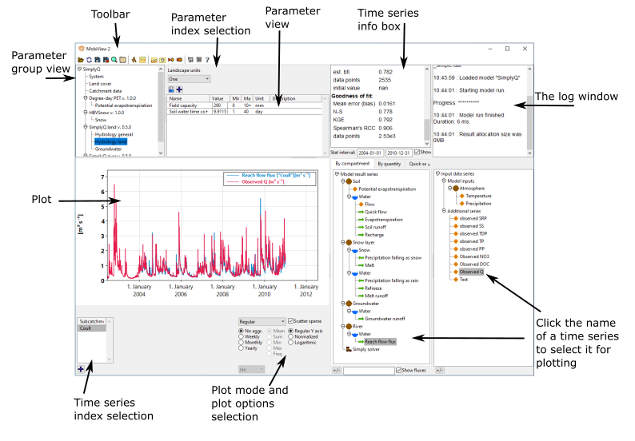

# MobiView2

## Introduction

MobiView2 is a graphical user interface that can load any model built using the [Mobius2 model language](../mobius2docs/language.html).

The GUI allows you to quickly explore effects of changing parameter values, plotting model results and calibrating the model using formal goodness-of-fit statistics. It also contains different systems for autocalibration, sensitivity and uncertainty analysis, including Markov Chain Monte Carlo.

MobiView2 is created using the [Ultimate++ framework](https://www.ultimatepp.org/) and the [Scatter](https://github.com/anboto/Scatter) plotting package.

## Parameter editing

MobiView2 allows you to [edit parameter values](parameters.html) and immediately re-run the model to see the effects. This gives you an interactive experience of calibrating the model and looking at effects of scenarios. When you re-run a model, the main plot (and additional plot view) is automatically refreshed with the new results.

## The main plot and series selection

MobiView2 allows you to explore model results using powerful visualization tools. You can select model result series and input series to be displayed in the [main plot](plots.html). There are also many different plot modes, such as line plots, histograms, profiles, heatmaps, etc. You can also transform the plot using various seasonal aggregations or similar.

Figure 1: A stacked plot of the groundwater recharge from different land use types in [SimplyQ](../existingmodels/simply.html#simplyq)

Figure 2: A heatmap plot of basin temperature in [NIVAFjord](../existingmodels/nivafjord.html). The y-axis indicates depth.

## The toolbar

The MobiView2 toolbar contains the following buttons
1.  **Open** (ctrl-O). When clicking this you can select a [model](../mobius2docs/language.html) `.txt` file and a [data](../datafiledocs/datafiles.html) `.dat` file. You have to do this before you can do anything else.
2.  **Reload** (F5). This reloads the currently selected model and data file. This discards any parameter edits that were not saved to the file.
3.  **Save** (ctrl-S). This saves any edits you have made to parameter values in MobiView2 back to the selected data file.
4.  **Save as** (ctrl-alt-S). This saves the selected data to a new file including any edits you have made.
5.  **Search** (ctrl-F). Opens a new window where you can search parameters by name to find their module and parameter group.
6.  **Model structure**. This opens a window with a graphical visualization of the model. It is mainly useful for model developers.
7.  **Run the model** (F7). Runs the model taking into account any edits to parameter values (whether or not they are saved to a file). After the model is run, the result time series are available for plotting **(link to separate doc when available)**
8.  **Additional plot view**. Opens an [additional window](additionalplots.html) where you can display multiple plots at the same time.
9.  **Save baseline**. Takes a background copy of the current dataset in memory. This is used in the "Compare baseline" plot mode **(link to separate doc when available)**. This can be used to compare model results before and after you edit parameters.
10.  **Revert to baseline**. Overwrites the current parameter values with the ones that were saved in the baseline copy (if one exists) and deletes the baseline copy.
11.  **Simple sensitivity**. Allows you to see the effect on one time series of [perturbing a single parameter](simplesensitivity.html).
12.  **Autocalibration and advanced sentitivity**. Allows you to (autocalibrate and run Markov Chain Monte Carlo and Variance-based sensitivity analysis)[advancedsensitivity.md] **(link to separate doc when available)**
13.  **Statistics settings**. Here you can turn on and off what statistics you want displayed in the time series info box, in addition to a few other settings.
14.  **Model structure debug information**. This opens a window that displays debug information about the compiled model. This is mainly useful for model developers **(link to separate doc when available)**
15.  **Model info**. This opens a window that displays any documentation that is written by the creator of the currently loaded model.

