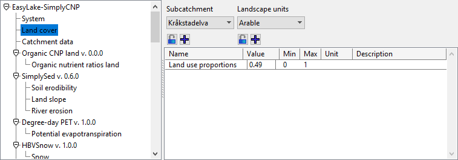
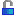

# Parameter viewing and editing

## The parameter selection and editing area

## The parameter group view and parameter index selection

In the parameter group view you can select what parameter group to view the parameters of. These are usually organized under what module (i.e. sub-model) they belong to, though some are just placed globally under the model. Each parameter group indexes over zero or more index sets. In the parameter index selection menus (Subcatchment and Landscape units in the example above) you can choose the (tuple of) indexes that you want for the current parameter view display.

If you click  (lock) under one or more of the index sets, any edit to a parameter value will be performed to all value instances over the locked index sets, not just to the value corresponding to the currently selected index tuple.

If you click  (expand) under one index set, the parameter view will expand to show all parameter values over that index set.

## The parameter view

The parameter view displays the full name, the value, the recommended min and max values, the unit and the description of each parameter in the selected group (if these were provided by the model creator).

The value field is editable. What type of field it is depends on the type of the parameter value. For instance, a parameter of type real is edited using a text field, while a parameter of type bool is edited using a check box since it is just an on-off switch.

Edits to a parameter will apply immediately if you re-run the model, but are only saved to a file if you click  in the toolbar.

## Special cases

Some of the functionality can be a bit different if there are so-called "sub-indexed" index sets or if some parameters are on so-called "map" form. This is rare, and will be documented later.

