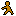
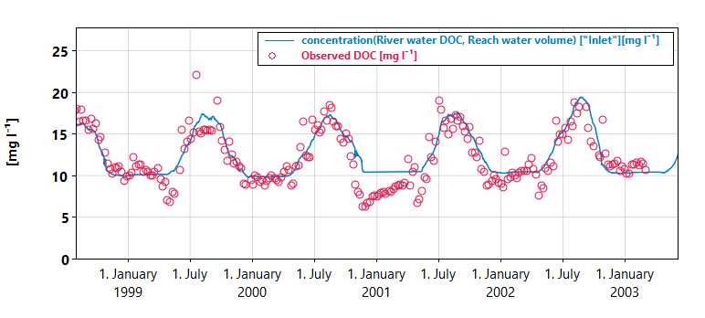
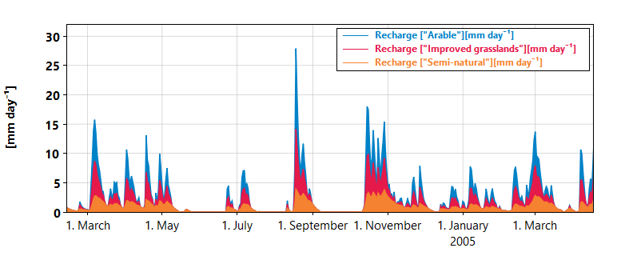
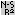

# Plots and statistics

You can use the plot to visualize inputs and results of the model. Time series can be selected in the result and model input trees to the left of the plot.

Series are organized in a tree structure according to their [location](../mobius2docs/central_concepts.html#components-and-locations). For instance, the soil water organic carbon is found under `Soil->Water->Organic carbon`. Non-primary state variables are instead organized under the location that makes the most sense, for instance a flux is organized under its source location if it is valid, otherwise its target location.

For model result series, you can also go to the "By quantity" tab to view series as organized by their final location component instead, so for instance soil water organic carbon is found there as `Organic carbon->Soil->Water`.

The "Quick select" tab only has content if the loaded data set has [`quick_select` declarations](../datafiledocs/new_project.html#quick-select). These can be set up to make it faster to select series you want to view often.

- You can select multiple time series at one time by ctrl-clicking (or shift-clicking) them.
- You can remove a selected time series by ctrl-clicking it. 
- If a time series varies over one or more index sets, you can select indexes from the lists below the plot. You can do multiselection (ctrl-click) here too.
- If you write text in the search bar under the series selecter, it will collapse all top nodes of the tree that don't match the search term. You can only search for the top node.

If you want multiple plot axes displayed at the same time, you need to open the [additional plot window](additionalplots.html) by clicking  in the toolbar.

The time series info box will display statistics about the selected time series. It can also display [goodness-of-fit statistics](statistics.html). Remember that you can load whatever time series data you want in the [data file](../datafiledocs/datafiles.md). This is useful for loading observation series that you want to compare to the model results.

The plot will automatically update itself every time you run the model  to reflect any changes in the result time series.

## Navigation

In many of the plot modes you can scroll and zoom the plot.

- Zoom the plot along the x-axis by using the scroll wheel on the mouse or click `ctrl plus` and `ctrl minus`.
- Scroll the plot along the x-axis by holding down the left button on your mouse and moving it. You can also use `ctrl left-arrow` and `ctrl right-arrow`.
- To zoom or scroll the y-axis you can right click the plot and remove the check on "Attach Y Axis".

## Context menu options

If you right click a plot you get context menu options (curtesy of the [Scatter](https://github.com/anboto/Scatter) package). These allow you to (among other things)
- Copy the plot to clipboard. Unfortunately, pasting it again only works in some applications and not others.
- Save the plot to a file.
- View the data behind the plot. Here you can for instance copy the data to a spreadsheet file using `ctrl-A` `ctrl-C`, then paste it inside a spreadsheet application, or you can directly export it as a `.csv` file.

## Plot options

The availability of the following options depend on the plot mode.

### Scatter sparse
If this option is checked it will use a scatter plot to display series that have isolated points (typically input series of observations).

### Aggregation
You can aggregate series over larger time intervals. The available aggregations are always larger than the sampling frequency of your current data set. You can also choose an aggregator function such as mean, sum, min, max, freq (the last one just counts the number of valid values per interval). If your aggregation interval is yearly, you can choose the pivot month in the dropdown list at the bottom.

### Transform 
You can choose transforms for the y axis.
- Regular Y axis. This applies no transform.
- Normalized. Every series is scaled independently so that it ranges between 0 and 1.
- Logarithmic. This appilies a logarithmic scale to the y axis.

## Plot modes

Plot modes can be chosen to visualize the selected series in different ways.

### Regular

The Regular plot mode provides a line plot or scatter plot of all selected time series as a function of time. This mode is compatible with all plot options.

### Stacked

The Stacked plot modes function like the regular plot mode, but makes a stacked plot instead of a line plot. Only result time series will be stacked, not input time series.

### Stacked share

The Stacked share mode is like Stacked, but normalizes all the time series so that they sum to 100. This allows you to visualize how large a percentage each time series is of the total.

### Histogram

This option only works if you have exactly one time series selected. it will make a histogram of the time series. The y axis displays the fraction of the total amount of data points that fall inside each bin.

### Profile

Select one time series. Moreover, select two or more indexes of exactly one index set that this time series varies over. For a given point in time, a bar plot will be displayed with the selected indexes as the X axis. The point in time can be selected using a slider or a text field. This mode also works together with aggregations, so you can display e.g. yearly mean values (for a selected year).

One use case for this is e.g. to view a depth profile of a variable in a 1D grid model such as [NIVAFjord](../existingmodels/nivafjord.html).

Click the  button to make it play an animation of the profile across the model run, and click  to rewind.

Note that the bars in the above plot are unevenly spaced because this particular model setup has non-uniform layer thickness.

### Heatmap

You select a series and a contiguous set of indexes for a given index set similarly to how you do it for the Profile mode above. This produces a heatmap where the x-axis is time and the y-axis is the indexes of the selected index set, while the color of the heatmap gives the value of the selected variable.

The example plot above shows temperature in a fjord basin as function of depth and time.

If you instead select multiple indexes of two different index sets, these index sets will be the x and y axes, and the time will be given by a slider just like in Profile mode.

### Compare baseline

This is only available if you have clicked the  button in the toolbar. You must have only one result time series (and optionally one input time series) selected. The plot will display both the current value of the selected time series and the value of the time series at the point you clicked . All plot options are available.

This can be useful for exploring differences in outcomes from different parameter sets. For instance, you can see how it affects the stream nitrate concentration if you change the agricultural fertilizer nitrogen input in [SimplyN](../existingmodels/simply.html#simplyn).

### Residuals

You must have exactly one result time series and one input time series selected. The plots shows the residual time series (observed - modeled). Select "Scatter inputs" to display it as a scatter plot instead of a line plot.

A linear regression line of the residuals is also displayed. This shows the trend in the residuals. For instance if this trend goes up, it says that the observed quantity increases over time compared to the modeled one. The regression line is only computed for the [stat interval](statistics.html).

You can also use aggregation. For instance, the monthly sum of the residuals of something like "Reach flow" versus "Observed flow" can tell you something about the monthly water balance in a hydrology model.

### Residuals histogram

You must have exactly one result time series and one input time series selected. The shows a histogram of the residuals. The number of bins are selected using the same rule as for the Histogram option. Moreover, red dots show what the distribution of residuals would look like if it was perfectly normally distributed (with the same mean and standard deviation).

### Quantile-Quantile

You must have exactly one result time series and one input time series selected. This shows a [quantile-quantile plot](https://en.wikipedia.org/wiki/Q%E2%80%93Q_plot) of the two time series, and can be used to see if your modeled time series is roughly similarly distributed to the observed one. If the quantiles are on the red diagonal, they are the same for the two series.

The displayed percentiles can be edited in the statistics settings window, which can be opened from the toolbar . The X axis is the result series, while the Y axis is the input series. The two have the same quantiles if the blue dots are on the red diagonal line.