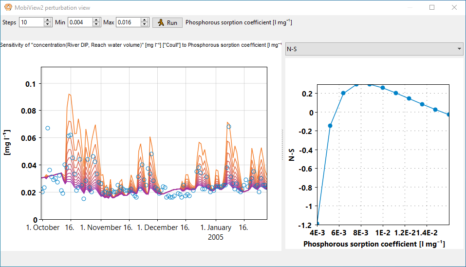

# Simple sensitivity

The perturbation view window is opened by clicking  in the toolbar.

You must select a single result series in the main window [in the same way you do it for plotting](plots.html). Optionally you can also select a single input series. You can only have one index selected per index set in the time series index selection.

You must also select a parameter in the [parameter view](parameters.html) of the main window by e.g. clicking its edit field.

Next, in the perturbation view window, you can select the minimum and maximum of the perturbation range, and select how many model evaluations will be done along that range (Steps). The steps along the parameter value will be uniformly spaced. All other parameters are held constant. Running this analysis uses a copy of a the main dataset, and does not affect the value of this parameter in your main dataset. The plot will show one version of the result series for each value of the perturbed parameter.

If an index set was locked  in the main window, all values across the indexes of that index set will be treated as a single parameter, and all of them will be given the same value.

You can also select a statistic to plot in the rightmost plot, with the perturbed parameter as the x axis and the statistic as the y axis. If you want to plot a [goodness-of-fit statistic](statistics.html#goodness-of-fit), you must have an input series selected that will be used as the comparison series. The [stat interval](statistics.html#the-stat-interval) from the main window will be used to compute the statistic.