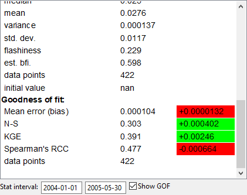

# Series statistics

MobiView2 computes several statistics for the selected series. These are displayed in the time series info box. What series are displayed can be configured by clicking  in the toolbar.

## The stat interval

You can select the stat interval below the time series info box. The interval consists of two dates, and only values between these dates (inclusive) will be considered in the statistics and goodness-of-fit computations.

## Goodness-of-fit

The goodness-of-fit statistics are displayed in the time series info box if you have exactly one result series and one [comparison input series](../datafiledocs/datafiles.html#model-inputs-and-comparison-series) selected, and the "Show GOF" box is checked. They are also used by the [autocalibrator](autocalibration.html).

During model calibration you can also see the changes in each statistic between runs. This is displayed to the right of the value, and is color coded to show if the change was good or bad. If the plot is in "compare baseline" mode, the changes in the GOF will be computed relative to the baseline, otherwise it is always relative to the previous run of the model.

Most of the goodness-of-fit statistics are implemented following \[Krause05\]. Further properties of the various statistics are discussed in that paper.

Let $$o=\{o_i\}_{i\in I}$$ be the observed time series, and let $$m=\{m_i\}_{i\in I}$$ be the modelled time series. The set $$I$$ of comparison points is the set of all time steps inside the stat interval where both series have a valid value. For instance, the observed time series can have missing values, so the timesteps corresponding to the missing values will not be considered when evaluating goodness-of-fit. The stat interval is the entire model run interval unless something else is specified by the user. Let

$$
\overline{m} = \frac{1}{|I|}\sum_{i\in I}m_i
$$

denote the mean of a time series.

### Data points

The data points is the size of the set of comparison points $$I$$.

### Mean error (bias)

The mean error is

$$
\overline{o - m} = \overline{o} -\overline{m} =\frac{1}{|I|} \sum_{i\in I} (o_i - m_i)
$$

For fluxes, the mean error is related to the discrepancy in mass balance.

### MAE
MAE is the mean absolute error

$$
\frac{1}{|I|}\sum_{i\in I}|o_i - m_i|,
$$

### RMSE
RMSE is the root mean square error

$$
\sqrt{\frac{1}{|I|}\sum_{i\in I}(o_i-m_i)^2}.
$$

### N-S
N-S is the Nash-Sutcliffe efficiency coefficient \[NashSutcliffe70\]

$$
1 - \frac{\sum_{i\in I}(o_i - m_i)^2}{\sum_{i\in I}(o_i-\overline{o})^2}.
$$

This coefficient takes values in $$(-\infty, 1]$$, where a value of 1 means a perfect fit, while a value of 0 or less means that the modeled series is a no better predictor than the mean of the observed series.

### log N-S
log N-S is the same as N-S, but where $$o_i$$ is replaced by $$\ln(o_i)$$ and $$m_i$$ by $$\ln(m_i)$$ for each $$i\in I$$. Here $$\ln$$ denotes the natural logarithm.

$$
1 - \frac{\sum_{i\in I}(\ln(o_i) - \ln(m_i))^2}{\sum_{i\in I}(\ln(o_i)-\overline{\ln(o)})^2}.
$$

This coefficient behaves similarly to N-S, but is less sensitive to errors on time steps where both series have large values.

### r2
$$r^2$$ is the coefficient of determination

$$
\left(\frac{\sum_{i\in I}(o_i-\overline{o})(m_i-\overline{m})}{\sqrt{\sum_{i\in I}(o_i-\overline{o})^2}\sqrt{\sum_{i\in I}(m_i-\overline{m})^2}}\right)^2.
$$

This coefficient takes values in $$[0, 1]$$.

### Idx. of agr.
The index of agreement is

$$
1 - \frac{\sum_{i\in I}(o_i-m_i)^2}{\sum_{i\in I}(|m_i-\overline{o}| + |o_i-\overline{o}|)^2}.
$$

### KGE
KGE is the Kling-Gupta efficiency \[KlingGupta89\]

$$
1 - \sqrt{(r-1)^2 + (\beta-1)^2 + (\delta-1)^2}
$$

where $$r$$ is the square root of the coefficient of determination $$r^2$$, $$\beta=\overline{m}/\overline{o}$$, and $$\delta=Cv(m)/Cv(o)$$, $$Cv(x)=\sigma(x)/\overline{x}$$, $$\sigma$$ being the standard deviation.

### Spearman's RCC
Spearman's rank correlation coefficient \[Spearman04\] is computed as follows: For a time series $$x=\{x_i\}_{i\in_I}$$, let $$\mathrm{rank}(x_i)$$ be the index of $$x_i$$ (starting from 1) in the list $$\mathrm{sort}(x)$$ (the values of $$x$$ sorted from smallest to largest). The rank correlation coefficient can then be computed as

$$
1 - \frac{6\sum_{i\in I}(\mathrm{rank}(o_i)-\mathrm{rank}(m_i))^2}{|I|(|I|^2 - 1)}.
$$

The coefficient takes values in $$[-1, 1]$$. If the value is 1, the modeled series is a (positively) monotone function of the observed series.

## Hydrological indexes

In addition to the common statistics like mean, standard deviation etc., MobiView computes some hydrological indexes. These are mostly meaningful only for flow series, but are computed for all series any way. See e.g. \[Fenicia18\] for reference.

### Flashiness

The flashiness index is defined as

$$
\frac{\sum_{i=2}^N|m_i-m_{i-1}|}{\overline{m}}
$$

and says something about how quickly the time series responds to events.

### Baseflow index (filter approximation)

The baseflow index approximation (est.bfi) is

$$
\frac{\sum{m_i^b}}{\sum{m_i}}
$$

where $$m_i^b$$ is the result of applying the following single pass forward filter to $$m_i$$:

$$
m_i^b = \min(m_i, am_{i-1}^b + (1-a)\frac{m_{i-1}+m_i}{2})
$$

The filter constant $$a$$ can be set in the statistics settings menu .

This index is an approximation that tries to separate out how much of the signal comes from a long-frequency source.

Note that even if you have a model that uses a "Baseflow index" parameter, this approximation will probably not coincide with that parameter, but should be linearly correlated with it.

## Citations

\[Krause05\] P Krause, D. P. Boyle, and F. Bäse. *Comparison of different efficiency criteria for hydrological model assessment*. Advances in Geosciences, 5, 89-97, [https://doi.org/10.5194/adgeo-5-89-2005](https://doi.org/10.5194/adgeo-5-89-2005), 2005.

\[NashSutcliffe70\] J. E. Nash and J. V. Sutcliffe. *River flow forcasting through conceptual models part I - A discussion of principles*. Journal of Hydrology, 10, 282-290, [https://doi.org/10.1016/0022-1694(70)90255-6](https://doi.org/10.1016/0022-1694(70)90255-6), 1970.

\[KlingGupta89\] H. V. Gupta, H. Kling, K. K. Yilmaz, and G. F. Martinez. *Decomposition of the mean squared error and NSE performance criteria: Implications for improving hydrological modelling*. J. Hydrol, 307, 80-91, [https://doi.org/10.1016/j.jhydrol.2009.08.003](https://doi.org/10.1016/j.jhydrol.2009.08.003), 2009.

\[Spearman04\] C. Spearman. *The proof and measurement of association between two things*. American Journal of Psychology, 15, 72.101, [https://doi.org/10.2307/1422689](https://doi.org/10.2307/1422689), 1904

\[Fenicia18\] Fabrizio Fenicia, Dmitri Kavetsky, Peter Reichert, and Carlo Albert. *Signature-domain calibration of hydrological models using approximate bayesian computation: Empirical analysis of fundamental properties*. Water Resources Research, 54, 4059-4083, [https://doi.org/10.1002/2017WR021616](https://doi.org/10.1002/2017WR021616), 2018

