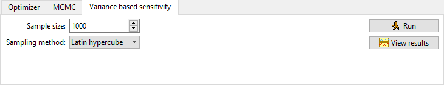

# Variance-based sensitivity

The setup of parameters and targets uses the [common setup](sensitivity.html#the-common-setup).

We compute two statistics that say something about how much of the variance of the (compound) target statistic is accounted for by each individual parameter.

The parameter space (with the user-provided min-max intervals) is sampled uniformly using either independent uniform sampling or Latin hypercube sampling.

We compute the first-order sensitivity coefficient (main effect index) and total effect index of the listed parameters on the chosen (compound) target statistic. The algorithms used for computation are based on the ones suggested in \[Saltelli10\].

The first-order sensitivity coefficient is

$$
S_i = \frac{V_{X_i}(E_{X_{\sim i}}(Y|X_i))}{V(Y)}
$$

where $$V$$ is the variance, $$E$$ the expected value, $$X=(X_i)_{i=1}^n$$ the parameter vector, $$X_{\sim i}$$ the parameter space excluding parameter $$i$$, and $$Y$$ the (compound) target statistic.

The total effect index is

$$
S_{T_i} = \frac{E_{X_{\sim i}}(V_{X_i}(Y|X_{\sim i}))}{V(Y)}
$$

The total effect index measures both the first-order effect and the higher-order effects (interactions between parameter $$i$$ and others). In general one has

$$
\sum_{i=1}^n S_i \leq 1,\; \sum_{i=1}^n S_{T_i} \geq 1.
$$

Note that since these are estimated using a Monte-Carlo method, they will not be exact, and especially small values are unreliable. The estimated first-order index can be negative even though the exact value has to be positive, and the estimated first order index could be smaller than the estimated total index even though that is not possible for the exact values. You can try to run with a higher number of samples if this becomes a problem.

In the result view, the histogram shows the distribution of the target statistic.

# Citations

\[Saltelli10\] Andrea Saltelli et. al. *Variance based sensitivity analysis of model output. Design and estimator for the total sensitivity index*. Computer Physics Communications, 181(2), 259-270, [https://doi.org/10.1016/j.cpc.2009.09.018](https://doi.org/10.1016/j.cpc.2009.09.018), 2010

